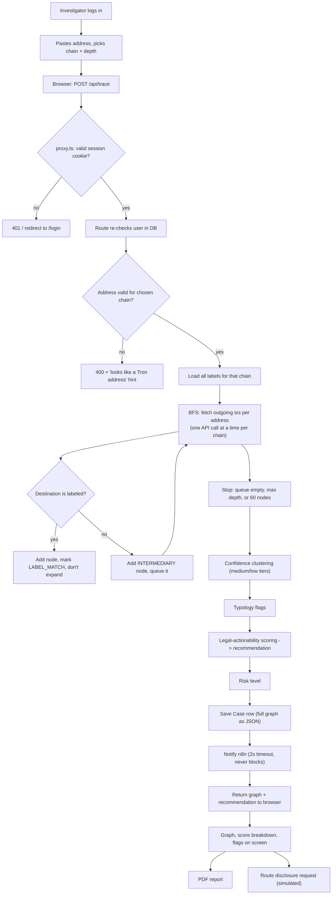
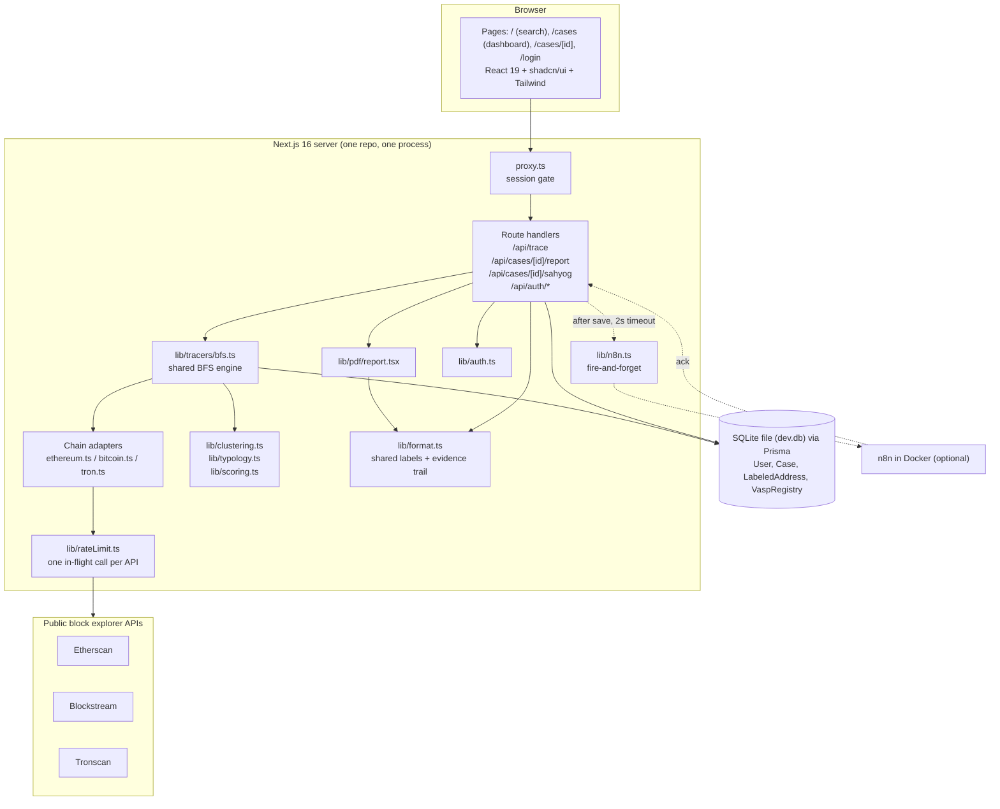
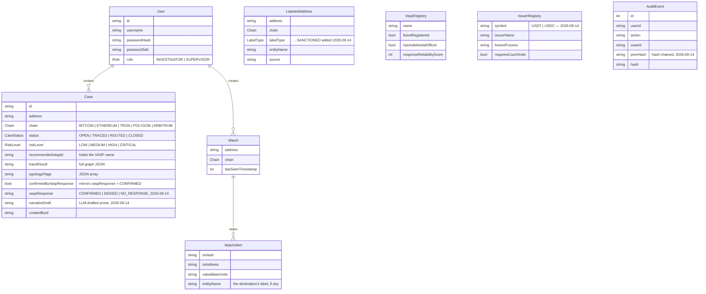

# VASPtrace, explained from zero

A complete walkthrough of what VASPtrace is, the problem it attacks, how every
feature works under the hood, how it's built, what already exists in this
space, and why it's different — written for someone who has never touched
crypto or "web3."

**How to read this.** Part 1 is the story in plain English. Part 2 is a
glossary: every buzzword used anywhere in this document, defined before the
rest of the doc leans on it. If you hit a word you don't know later, it's in
Part 2. Parts 3 onwards get progressively more technical, but nothing in them
assumes more than the glossary.

Every number in this document (thresholds, weights, caps) was read out of the
actual source code, not from other docs, and the file it lives in is named
next to it so you can check.

**Written pre-phase-2; updated in place as phase-2 shipped** (search
"2026-09-14" for every touch point — corrected facts this doc originally got
wrong at submission time, and new Part 5 features for everything phase-2
added: Bitcoin common-input clustering folded into Feature 4, and Features
12-18 covering issuer freeze paths, live OFAC sync, the address watchlist,
the chain-of-custody log, the VASP-response feedback loop, the LLM-drafted
narrative, and money-tracking). `docs/ROADMAP.md` and `docs/PROGRESS.md`
remain the dated, decision-by-decision record if you want the "why," not
just the "what."

---

## Contents

- [Part 1 — The story](#part-1--the-story)
- [Part 2 — Glossary: every buzzword](#part-2--glossary-every-buzzword)
  - [A. Blockchain basics](#a-blockchain-basics)
  - [B. How value moves on a chain](#b-how-value-moves-on-a-chain)
  - [C. Where crypto meets the real world](#c-where-crypto-meets-the-real-world)
  - [D. Crime and money laundering](#d-crime-and-money-laundering)
  - [E. Indian (and global) law and regulators](#e-indian-and-global-law-and-regulators)
  - [F. Investigation and graph concepts](#f-investigation-and-graph-concepts)
  - [G. Software and web terms](#g-software-and-web-terms)
  - [H. Security terms](#h-security-terms)
- [Part 3 — The problem, in detail](#part-3--the-problem-in-detail)
- [Part 4 — The life of one trace, end to end](#part-4--the-life-of-one-trace-end-to-end)
- [Part 5 — Every feature, intricately](#part-5--every-feature-intricately)
- [Part 6 — Architecture](#part-6--architecture)
- [Part 7 — Tech stack](#part-7--tech-stack)
- [Part 8 — What already exists](#part-8--what-already-exists)
- [Part 9 — Why VASPtrace is different](#part-9--why-vasptrace-is-different)
- [Part 10 — Honest limitations](#part-10--honest-limitations)
- [Part 11 — Things in the code that will confuse you](#part-11--things-in-the-code-that-will-confuse-you)

---

## Part 1 — The story

Imagine a fraud victim in Pune. They were talked into an "investment" and sent
money that was converted into cryptocurrency. The police get the case. The only
concrete lead they have is a **wallet address** — a long string like
`0x6eedf92fb92dd68a270c3205e96dccc527728066` — where the money was sent.

Here is the strange thing about crypto that makes this both easy and hard:

- **Easy:** every payment ever made from that address is public. Anyone on
  earth can look it up. There is no bank to subpoena just to *see* the
  transactions.
- **Hard:** the address has no name attached. It's a string of characters, not
  a person. The public record tells you *money moved from A to B to C*; it
  never tells you *who* A, B or C are.

So the real question is not "where did the money go" — that's readable. The
real question is: **somewhere along that chain of payments, did the money land
at a company that knows who its customer is, and can Indian police legally make
that company tell them?**

Crypto exchanges (like WazirX, CoinDCX, Binance) are such companies. When
someone converts crypto back into rupees, they almost always go through an
exchange, and a regulated exchange must collect identity documents from its
users. If police can show "this money reached this exchange," they can send the
exchange a legal request: *who owns the account that received this?*

**VASPtrace automates that whole reasoning.** You paste the suspect address. It
follows the money outward, payment by payment ("hop by hop"), across Bitcoin,
Ethereum or Tron. It stops when it reaches an address it recognizes — an
exchange, a mixer, a ransomware wallet. It draws the whole path as an
interactive map. And then it does the thing no generic tool does: it ranks the
exchanges it found by **how legally actionable they are for Indian law
enforcement** — is the exchange registered with India's financial intelligence
regulator, does it have an officer in India who answers police, how reliably
does it respond — and recommends which one to ask first, *showing the
arithmetic*. Finally it writes a PDF investigation report and prepares
(in simulation) the disclosure request you'd send.

It was built in 5 days for the **Smart India Hackathon**, problem statement
**26182**, set by the **Ministry of Home Affairs** through the **Indian
Cybercrime Coordination Centre (I4C)**. All of those names are explained below.

---

## Part 2 — Glossary: every buzzword

### A. Blockchain basics

**Web3.** A loose marketing umbrella for internet services built on
blockchains instead of on one company's servers. "Web1" was read-only pages,
"Web2" is platforms you log into (Google, Instagram) where the company holds
your data, "Web3" is the pitch that users hold their own assets and data on a
public blockchain. For this project, "web3" just means "crypto and the
blockchains it runs on."

**Blockchain.** A shared, append-only record book (a **ledger**) of
transactions, copied across thousands of computers worldwide. New entries are
added in batches called **blocks**; each block contains a fingerprint (hash) of
the block before it, which chains them together — hence "block chain." Because
every block depends on the one before, changing an old entry would change
every fingerprint after it, and every other copy of the ledger would disagree.
That makes past entries practically impossible to rewrite.

**Block.** One batch of transactions added to the chain at a time. Bitcoin adds
a block roughly every 10 minutes, Ethereum every 12 seconds, Tron every
3 seconds.

**Ledger.** An accounting record of who paid whom. A blockchain is a public
ledger.

**Decentralized.** No single company or government runs it. The copies are kept
by many independent operators, so there's no central office to shut down or
subpoena for the ledger itself. (There *are* central companies around the edges
— exchanges — which is exactly what VASPtrace looks for.)

**Network node (blockchain sense).** One of the computers keeping a copy of the
ledger. *Don't confuse this with a "node" in a graph* (see section F) — in
VASPtrace's code and UI, "node" almost always means a dot on the money-flow
graph, i.e. an address.

**On-chain / off-chain.** On-chain = recorded in the public ledger (a payment
between two addresses). Off-chain = everything else (an exchange's internal
customer database, a Telegram chat, a bank account). VASPtrace reads on-chain
data and uses it to point at the off-chain party who holds identity records.

**Pseudonymous (vs. anonymous).** Crypto is not anonymous — every action is
public and permanently tied to an address. It is *pseudonymous*: the address is
a pseudonym with no name attached. The moment any address is linked to a real
identity (e.g. an exchange's records), its entire history becomes attributable.
That property is the whole reason blockchain tracing works.

**Chain.** Shorthand for a specific blockchain. VASPtrace supports three:

- **Bitcoin (BTC)** — the original cryptocurrency (2009). Just money, no apps.
- **Ethereum (ETH)** — a blockchain that also runs programs (smart contracts).
  Home of most tokens and DeFi.
- **Tron (TRX)** — an Ethereum-like chain with very low fees; the most popular
  rail for moving the stablecoin USDT, which makes it central to fraud cases.

**Block explorer.** A website that lets you search the public ledger in a
human-friendly way — look up an address, see its transactions. Etherscan
(Ethereum), Blockstream (Bitcoin) and Tronscan (Tron) are block explorers.
VASPtrace calls their **APIs** (section G) instead of scraping their pages.

**Mainnet.** The real, live blockchain where money has value (as opposed to a
"testnet" used for experiments). VASPtrace only reads mainnet. In
`lib/etherscan.ts` you'll see `ETH_MAINNET_CHAIN_ID = 1`.

### B. How value moves on a chain

**Wallet.** Software (an app, a browser extension, a hardware device) that
holds your keys and lets you send crypto. People say "wallet" loosely to mean
"address" too — VASPtrace does, in "suspect wallet."

**Address.** The public identifier you send crypto *to*, like a bank account
number anyone can see. Each chain has its own format, and VASPtrace validates
them (`lib/address.ts`):

| Chain | Looks like | Example |
|---|---|---|
| Ethereum | `0x` + 40 hexadecimal characters | `0x28c6c06298d514db089934071355e5743bf21d60` |
| Bitcoin | starts with `1`, `3` or `bc1` | `3M219KR5vEneNb47ewrPfWyb5jQ2DjxRP6` |
| Tron | starts with `T` | `TXFBqBbqJommqZf7BV8NNYzePh97UmJodJ` |

Because the formats don't overlap, VASPtrace can tell you "that looks like an
Ethereum address, but Bitcoin is selected" instead of just "invalid." Ethereum
addresses are **case-insensitive** (VASPtrace lowercases them); Bitcoin and
Tron addresses are **case-sensitive** (lowercasing one produces a different,
wrong address — so VASPtrace deliberately doesn't).

**Public key / private key.** A pair of linked numbers. The **private key** is
the secret that authorizes spending; whoever has it controls the funds. The
address is derived from the **public key**, which is safe to share. VASPtrace
never touches keys — it only reads public data.

**Seed phrase.** 12 or 24 words that regenerate a wallet's private keys. Not
used by VASPtrace; mentioned because it comes up in fraud cases ("the scammer
asked for my seed phrase").

**Transaction (tx).** One recorded action on the ledger — usually "send X
coins from address A to address B," but on Ethereum/Tron it can also be
"call this program."

**Transaction hash (tx hash / txid).** A unique fingerprint identifying one
transaction, e.g. `0x5c50…`. It's the permanent, verifiable citation for "this
payment happened." VASPtrace puts tx hashes in its **evidence trail** so anyone
can independently check every claim on a block explorer.

**Hash.** A function that turns any data into a fixed-length fingerprint. The
same input always gives the same output, and you can't work backwards from
output to input. Used for tx IDs, block chaining, and (differently) for
password storage (section H).

**Confirmation / mempool.** A transaction is **confirmed** once it's included
in a block. Before that it waits in the **mempool** (memory pool). Blockstream's
API returns confirmed transactions plus mempool ones.

**Native coin (native currency).** The chain's own built-in money: ETH on
Ethereum, BTC on Bitcoin, TRX on Tron. Transfers of it are built into the chain
itself.

**Base units: wei, satoshi, sun.** Blockchains store amounts as whole numbers
of a tiny unit, never as decimals:

- 1 ETH = 1,000,000,000,000,000,000 **wei** (10^18)
- 1 BTC = 100,000,000 **satoshis** (10^8)
- 1 TRX = 1,000,000 **sun** (10^6)

VASPtrace stores every amount in base units as text and does math with
JavaScript's `BigInt`, because 10^18 is far beyond what a normal JavaScript
number can hold exactly. The graph converts to ETH/BTC/TRX only for display.

**Gas / fees.** The fee paid to the network for processing a transaction.
On Ethereum it's called **gas** and is paid in ETH; Tron uses "energy" and
"bandwidth." Not modeled by VASPtrace.

**Account model vs. UTXO model.** Two ways chains track balances.

- **Account model** (Ethereum, Tron): like a bank — each address has a
  balance, and a transaction moves an amount from one to another.
- **UTXO model** (Bitcoin): "Unspent Transaction Output." There are no
  balances, only coins-like chunks. A transaction *consumes* whole chunks as
  **inputs** and creates new chunks as **outputs**. If you have a 1 BTC chunk
  and want to pay 0.3, the transaction sends 0.3 to the recipient and 0.7 back
  to yourself as **change**.

**Change address.** Where Bitcoin "change" goes. Sometimes it's the same
address that paid; often wallets use a fresh address. VASPtrace's Bitcoin
adapter (`lib/blockstream.ts`) treats an output back to the same address as
change and ignores it, but **cannot detect change sent to a fresh address** —
that shows up as an extra "hop." This is a documented limitation.

**Smart contract.** A program stored on the blockchain (mostly Ethereum and
Tron) that runs when someone sends it a transaction. Tokens, exchanges,
lending apps and multisig wallets are all smart contracts.

**EOA (Externally Owned Account).** An Ethereum address controlled by a private
key held by a person or service — as opposed to a **contract account**,
controlled by code.

**Contract call.** A transaction whose purpose is to run a function on a smart
contract, not (necessarily) to move native coin. It often carries **zero**
value.

**Calldata / function selector.** The data sent with a contract call that says
*which* function to run and with what arguments. The first 4 bytes are the
**function selector** (e.g. `0x2d8a122e`). Sites like the 4byte directory map
selectors to human-readable function names — when they know them.

**Token.** A digital asset created *by a smart contract* on top of a chain,
rather than built into the chain. Token transfers are recorded as calls to the
token's contract, not as native transfers — which is why a native-only tracer
misses them (see Part 10).

**ERC-20 / TRC-20.** The standard rulebooks for tokens on Ethereum (ERC-20)
and Tron (TRC-20). Any token following the standard works with any wallet.

**Stablecoin.** A token designed to stay worth a fixed amount, usually
1 US dollar.

**USDT (Tether).** The largest stablecoin, issued by the company Tether. It
exists on many chains; **USDT on Tron (USDT-TRC20)** is the dominant rail for
moving fraud proceeds because it's dollar-stable and fees are tiny. USDT uses 6
decimal places, while ETH uses 18 — so you can't just add a USDT amount to an
ETH amount.

**Issuer / freeze.** The company behind a stablecoin (Tether for USDT, Circle
for USDC). Issuers can **freeze** a specific address's tokens at law
enforcement's request — an important legal lever VASPtrace does not yet model
(roadmap item 3).

**Multisig.** A wallet that needs several keys to approve a spend (e.g. 3 of 5
executives). Exchanges use them to protect large reserves.

**Gnosis Safe (now "Safe").** The most common multisig smart contract on
Ethereum. It uses a **proxy contract**: a small contract that forwards every
call to a shared "master copy" of the real code. VASPtrace's headline demo
address turns out to interact with WazirX's Gnosis Safe (Part 5, feature 5).

**DeFi (Decentralized Finance).** Financial apps run purely by smart contracts
— swaps, lending — with no company operating them. Important here because
there is often nobody to send a legal request to.

**Bridge.** A service that moves value from one chain to another (e.g. lock ETH
on Ethereum, receive a wrapped version on another chain). Criminals use bridges
to break a trace, because a single-chain tracer sees the money vanish into the
bridge.

**Cross-chain.** Anything spanning more than one blockchain.

### C. Where crypto meets the real world

**Exchange.** A business where people buy and sell crypto, often for rupees.

- **CEX (centralized exchange):** a company (WazirX, CoinDCX, Binance). Holds
  customer funds, runs KYC, can be served legal requests. **This is what
  VASPtrace hunts for.**
- **DEX (decentralized exchange):** a smart contract (e.g. Uniswap). No
  company, no KYC, nobody to serve.

**Custodial vs. non-custodial.** Custodial = a company holds the keys for you
(an exchange account). Non-custodial = you hold your own keys (a personal
wallet). Only custodians have customer records to disclose.

**Hot wallet / cold wallet.** An exchange's **hot wallet** is kept online to
process withdrawals quickly; its **cold wallet** stores most reserves offline.
Both are publicly labeled on explorers for major exchanges, which is where
VASPtrace's labels come from (e.g. `"Binance 14"`, `"Binance (cold wallet)"`).

**Deposit address.** A unique address an exchange generates for each customer
to send crypto *in*. The exchange then periodically **sweeps** (forwards)
everything from deposit addresses into its hot wallet. Deposit addresses are
almost never publicly labeled — but their behavior is recognizable: they
forward nearly everything they receive to one exchange wallet. VASPtrace's
**medium-confidence** heuristic is built on exactly this (Part 5, feature 4).

**On-ramp / off-ramp.** Converting money into crypto (on-ramp) or crypto back
into rupees/dollars (off-ramp). Criminals must eventually off-ramp to spend,
and off-ramps are exchanges — the chokepoint.

**VASP (Virtual Asset Service Provider).** The regulatory term, coined by
FATF (below), for any business that exchanges, transfers or holds crypto on
behalf of customers — exchanges, custodial wallets, some payment services. In
India, VASPs are regulated under money-laundering law and must register with
FIU-IND. "VASP" is literally the first half of the product name.

**KYC (Know Your Customer).** The legal obligation for a financial business to
verify who its customers are — ID documents, PAN, selfie, address proof. KYC
records are the prize: they turn an address into a person.

**AML (Anti-Money Laundering).** The body of law, rules and practices meant to
stop criminals from disguising the origin of money. KYC is one AML tool;
transaction monitoring and suspicious-activity reporting are others.

### D. Crime and money laundering

**Money laundering.** Making criminal money look legitimate. Classically in
three stages:

1. **Placement** — getting dirty money into the financial system (e.g. buying
   crypto with fraud proceeds).
2. **Layering** — moving it through many transactions to obscure its origin
   (hops, mixers, bridges, chain-hopping).
3. **Integration** — bringing it back as seemingly clean money (off-ramping at
   an exchange, buying assets).

VASPtrace's tracer follows the **layering**, and its target is the
**integration** point.

**Typology.** A recognized *pattern* of criminal financial behavior — a named
shape that laundering tends to take. VASPtrace detects three (below).

**Smurfing / structuring.** Splitting a large amount into many small
transactions or many destinations so no single transfer looks suspicious.

**Fan-out.** One address sending to many destinations — the on-chain shape of
smurfing. **Fan-in** is the reverse: many addresses sending into one (the shape
of a collection or consolidation address).

**Peel chain.** A laundering pattern where an address sends a small amount to
one destination ("peels off" a slice, often to cash out) and the large
remainder onward to a new address, which repeats the process. Hop after hop,
you see one small leg and one big leg.

**Mixer (tumbler).** A service that pools many users' coins and pays them out
so that the link between who paid in and who withdrew is broken. Legitimate
privacy tool in theory; heavily used for laundering in practice.

**Tornado Cash.** The best-known Ethereum mixer, a set of smart contracts with
fixed-size pools (0.1, 1, 10, 100 ETH). The US sanctioned it in August 2022 and
delisted it in March 2025. VASPtrace seeds two Tornado Cash addresses as
`MIXER` and says so in their label names.

**CoinJoin.** A Bitcoin technique where many users combine their payments into
one transaction, so it's unclear which input paid which output. It
deliberately defeats Bitcoin clustering (below).

**Anonymity set.** The number of possible candidates something could belong
to. If 10,000 people deposited 1 ETH into a pool, a 1 ETH withdrawal has an
anonymity set of 10,000 — a pure guess would be right 1 time in 10,000.

**Darknet market.** An illegal online marketplace (drugs, stolen data), usually
accessible only via Tor and paid in crypto. VASPtrace has a `DARKNET` label
type, though no darknet address is seeded yet.

**Ransomware.** Malware that encrypts a victim's files and demands crypto for
the key. VASPtrace seeds one ransomware address: the SamSam cash-out address
the US sanctioned in 2018 — the first crypto address ever put on the US
sanctions list.

**Pig-butchering / investment fraud.** Long-con scams where a victim is groomed
(often via dating or messaging apps) and "invests" in a fake crypto platform.
Proceeds typically move as USDT on Tron. A major driver of Indian cybercrime
cases.

**Money mule.** A person (often recruited or deceived) whose account or wallet
is used to move criminal money, adding a layer between the criminal and the
funds.

**Hack / exploit.** Theft by breaking into a system. Relevant here because
WazirX was hacked in July 2024 (roughly $230M stolen from a multisig wallet),
and VASPtrace's headline demo address interacts with WazirX's multisig in
exactly that window.

### E. Indian (and global) law and regulators

**MHA (Ministry of Home Affairs).** The Indian ministry responsible for
internal security and policing policy.

**I4C (Indian Cybercrime Coordination Centre).** A body under MHA that
coordinates how Indian law enforcement handles cybercrime nationally — it runs
the national cybercrime reporting portal (cybercrime.gov.in) and the 1930
helpline. It set the hackathon problem VASPtrace answers.

**LEA (Law Enforcement Agency).** Any police or investigative body — state
police cyber cells, CBI, ED, etc. VASPtrace's user.

**Sahyog.** A portal run by I4C for sending legal notices and requests from
Indian agencies to online platforms and service providers, so each request
doesn't have to go by ad-hoc email. VASPtrace treats it as the channel a
disclosure request would travel through. **There is no public API for it**, so
VASPtrace's routing is **simulated** and labeled as such everywhere.

**Disclosure request.** A formal legal demand to a company to hand over
information — here, "tell us which customer controls the account that received
funds at this address." It's the concrete output VASPtrace is built to support.

**Section 94, BNSS (formerly Section 91, CrPC).** The legal provision
VASPtrace cites as the basis for its disclosure request (`LEGAL_BASIS` in
`lib/format.ts`). India's Code of Criminal Procedure let police summon a
person to produce a document under Section 91; the CrPC was replaced on 1
July 2024 by the **Bharatiya Nagarik Suraksha Sanhita (BNSS)**, whose
equivalent "summons to produce document or other thing" provision is
Section 94 — fixed 2026-09-14 (was still citing the repealed CrPC section;
see Part 10). Still worth confirming with someone with legal training before
any real use — this is a correction to a known-stale citation, not a claim
of legal authority.

**FIU-IND (Financial Intelligence Unit – India).** The national agency, under
the Ministry of Finance, that receives and analyzes reports of suspicious
financial transactions. Since March 2023, crypto VASPs operating in India are
**reporting entities** under money-laundering law and must register with
FIU-IND. Registration means the exchange has formally accepted Indian AML
obligations — so it's far more likely to answer an Indian police request.
**This is one of the three inputs to VASPtrace's legal-actionability score.**

**PMLA (Prevention of Money Laundering Act, 2002).** India's main
anti-money-laundering law — the one that brought VASPs under FIU-IND.

**Reporting entity.** A business legally required to keep records and report
suspicious transactions to FIU-IND (banks, and now VASPs).

**Nodal officer.** A named person inside a company whose job is to receive and
handle requests from law enforcement. A VASP with a nodal officer **based in
India** gives police a real person to call rather than an overseas web form.
**The second input to VASPtrace's score.**

**Offshore exchange.** An exchange headquartered and operating outside India.
It may serve Indian users but has weaker (or no) obligation to respond to Indian
police.

**OFAC (Office of Foreign Assets Control).** The US Treasury office that
administers US sanctions.

**SDN list (Specially Designated Nationals).** OFAC's list of sanctioned people
and entities; since 2018 it includes crypto addresses. It matters in India too,
because global exchanges and stablecoin issuers comply with it. Several
VASPtrace seed labels come from SDN designations.

**Sanctions.** Legal prohibitions on dealing with a listed person, entity or
address.

**FATF (Financial Action Task Force).** The intergovernmental body that sets
global AML standards; it coined the term "VASP." India is a member.

**Chain of custody.** The documented record of who handled evidence, when,
and what they did — what lets evidence stand up in court. VASPtrace has one
since 2026-09-14: an append-only, hash-chained log of every trace, view,
download, route and response. See Feature 15 in Part 5.

### F. Investigation and graph concepts

**Tracing.** Following money from one address to the next through the public
ledger.

**Hop.** One step in a trace: one address paying another. "WazirX is 2 hops
away" means suspect → some address → WazirX.

**Depth.** How many hops from the suspect an address sits. The suspect is depth
0, whoever it paid directly is depth 1, and so on. **Max depth** is how far
VASPtrace is allowed to follow (default 5, allowed range 1–10).

**Multi-hop tracing.** Following money across many hops, which is necessary
because launderers deliberately insert intermediate addresses.

**Graph.** In math/computing, a set of **nodes** (dots) connected by **edges**
(lines). A money trail is naturally a graph.

**Node (graph sense).** One dot — in VASPtrace, one address. Each node has a
**kind**: `SUSPECT`, `INTERMEDIARY` (unlabeled address in between), `EXCHANGE`,
`MIXER`, `DARKNET`, `RANSOMWARE`, `BRIDGE` or `UNKNOWN`.

**Edge.** One line between two nodes — in VASPtrace, "address A sent to
address B." All transactions from A to B are combined into a single edge with a
total value and a transaction count.

**Directed graph.** A graph whose edges have a direction (A → B is not B → A).
Money flow is directed.

**Breadth-First Search (BFS).** An algorithm for exploring a graph level by
level: first everything 1 hop away, then everything 2 hops away, and so on,
using a queue. VASPtrace's tracer is a BFS (`lib/tracers/bfs.ts`). BFS
guarantees that when an exchange is found, it's found at its shortest hop
distance first.

**Queue.** A first-in-first-out list: things are processed in the order they
were added. BFS uses one to remember which addresses to expand next.

**Fan-out cap / node budget.** Safety limits on how much a trace can explore.
The fan-out cap limits how many destinations are followed from any single
address; the node budget limits the total number of addresses in one trace.
Without them, one busy address (thousands of counterparties) would explode the
trace and exhaust the API.

**Label / labeled address.** A known, verified fact of the form "address X
belongs to entity Y" (e.g. "this is Binance's cold wallet"). VASPtrace's label
database is its ground truth.

**Attribution.** Assigning a real-world identity to an address. The core
difficulty of blockchain forensics.

**Ground truth vs. heuristic.** Ground truth = a verified fact (an exact label,
an on-chain transaction). **Heuristic** = a rule of thumb that is usually but
not always right. VASPtrace ranks ground-truth capability above heuristics and
labels every heuristic as one.

**Clustering.** Grouping multiple addresses that likely belong to the same
real-world entity. VASPtrace does a light behavioral form of this (confidence
tiers); full Bitcoin clustering is on the roadmap.

**Common-input-ownership heuristic.** The classic Bitcoin clustering rule: if
several addresses are used as *inputs to the same transaction*, one wallet
almost certainly controls them all (you need all their keys to sign). CoinJoin
is the known way to break it. Not yet implemented (roadmap item 2).

**Confidence score / confidence tier.** How sure VASPtrace is about an
attribution: `high` (exact label match), `medium` (behavioral clustering),
`low` (pattern-based guess).

**Risk level.** A case-level classification — `LOW`, `MEDIUM`, `HIGH`,
`CRITICAL` — derived from rules (Part 5, feature 7).

**Legal actionability.** How realistic it is for Indian law enforcement to get
a useful response from a given entity. VASPtrace turns this into a number
(Part 5, feature 3).

**Force-directed graph.** A way of drawing a graph where nodes repel each other
and edges pull like springs, and a physics simulation settles them into a
readable layout. VASPtrace draws traces this way.

**Evidence trail.** The list of transaction hashes backing the claims in a
report or disclosure request — so every assertion can be independently checked.

**Explainability.** The ability to show *why* a system reached a conclusion. A
core design commitment here: scores show their arithmetic on screen.

**Black box.** A system whose output you have to trust without seeing its
reasoning — the opposite of explainable. Many AI/ML risk scores are black
boxes.

**AI / ML (Machine Learning).** Systems that learn patterns from data rather
than following hand-written rules. VASPtrace deliberately uses **no** AI/ML for
scoring, risk or flags; everything is fixed, readable rules.

### G. Software and web terms

**Frontend / backend.** Frontend = what runs in your browser (the pages you
see). Backend = what runs on the server (talking to databases and APIs).

**API (Application Programming Interface).** A way for one program to request
data from another over the internet in a structured format. Block explorers
offer APIs; VASPtrace also exposes its own (e.g. `POST /api/trace`).

**Endpoint / route.** One specific API address, like `/api/trace`.

**HTTP methods: GET / POST.** GET asks for data; POST sends data to be acted
on. Starting a trace is a POST.

**HTTP status codes.** Numbers a server returns: `200` OK, `400` bad input,
`401` not logged in, `403` forbidden, `404` not found, `502` an upstream
service failed.

**JSON.** A plain-text data format (`{"chain": "ETHEREUM"}`) used by nearly
every web API. VASPtrace stores each full trace as one JSON blob.

**API key.** A secret string identifying you to an API. Etherscan requires one;
Blockstream doesn't; Tronscan works without one at low volume.

**Rate limit.** A cap an API puts on how much you can call it. Exceed it and
calls start failing (Etherscan answers `NOTOK`).

**Pacing / serialization.** Deliberately spacing out or queueing requests so as
not to hit a rate limit. VASPtrace allows exactly one request in flight per
chain API at a time (`lib/rateLimit.ts`).

**Pagination.** Fetching a long list page by page. VASPtrace mostly fetches
only the first page (Part 10).

**TypeScript.** JavaScript with types — the compiler catches many mistakes
before code runs. The entire project is TypeScript.

**React.** A JavaScript library for building user interfaces out of reusable
components.

**Next.js.** A framework on top of React that handles pages, routing and
server-side code in one project. VASPtrace uses **Next.js 16**, which renamed
some conventions older tutorials use (see `proxy.ts` below).

**App Router.** Next.js's system where the folder structure under `app/`
defines the site's URLs — `app/cases/[id]/page.tsx` becomes `/cases/<some id>`.

**Route handler.** A file (`route.ts`) under `app/api/…` that serves an API
endpoint instead of a page.

**Server component / client component.** In modern Next.js, components render
on the server by default (can read the database directly, send finished HTML).
A file marked `"use client"` runs in the browser (needed for interactivity,
canvases, charts).

**Hydration.** When browser JavaScript takes over HTML the server already sent,
making it interactive.

**shadcn/ui.** A collection of well-designed UI components (buttons, cards,
dialogs) that you copy into your own project rather than install as a black-box
library. Lives in `components/ui/`.

**Tailwind CSS.** A styling approach using small utility class names directly
in markup (`text-3xl font-bold`) instead of separate stylesheets.

**Design tokens / CSS variables.** Named color and spacing values (like
`--primary`, `--risk-low`) defined once in `app/globals.css` and used
everywhere, so a theme change happens in one place.

**Light/dark mode.** Two color themes; VASPtrace supports both via
`next-themes`.

**WCAG / contrast ratio.** WCAG is the web accessibility standard. It requires
normal text to have at least a 4.5:1 brightness contrast against its
background. VASPtrace measured its risk badges against this.

**lucide-react.** An icon library (the wallet, shield and alert icons in the
UI).

**Database.** Organized persistent storage.

**SQLite.** A database that is just a single file on disk (`dev.db`) — no
server to run. Chosen so the demo works offline.

**Postgres (PostgreSQL).** A full database server. An experimental port exists
on the separate `vercel-postgres` branch.

**ORM (Object-Relational Mapper).** A library that lets code work with database
rows as typed objects instead of writing raw SQL.

**Prisma.** The ORM used here. `prisma/schema.prisma` defines the tables
("models"); Prisma generates a typed client from it.

**Schema / model.** The definition of what tables exist and what fields they
have.

**Migration.** A recorded, repeatable change to the database's structure
(adding a column, etc.).

**Seed / seed script.** A script that fills a fresh database with starting
data. `prisma/seed.ts` loads the labeled addresses, the VASP registry and the
demo accounts.

**Enum.** A field restricted to a fixed set of values, e.g. `Chain` can only be
`BITCOIN`, `ETHEREUM` or `TRON`.

**Webhook.** A URL that one system calls to notify another that something
happened ("a trace just finished, here are the details"). n8n listens on
webhooks.

**Workflow automation.** Tools that chain steps ("when X arrives, check Y, if
true send Z") visually, without writing a full program.

**n8n.** An open-source workflow automation tool with a visual canvas of
connected nodes (again, a different "node": here, a step in a workflow).
VASPtrace uses it to *show* its pipeline running, not to run it.

**Docker / container / Docker Compose.** Docker packages software with
everything it needs into a **container** that runs the same anywhere. **Docker
Compose** starts containers from a config file (`docker-compose.yml`) with one
command. n8n runs this way.

**Fire-and-forget.** Sending a notification without waiting for or depending
on the result. If it fails, nothing else breaks.

**Timeout.** A maximum wait. VASPtrace gives up on n8n after 2 seconds.

**Environment variable (`.env`).** Configuration passed to the app outside the
code — API keys, secrets, webhook URLs. `.env.example` lists them.

**Self-check / test.** A small runnable script that fails if logic breaks.
VASPtrace has five: `npx tsx lib/{address,clustering,typology,scoring,format}.test.ts`.

**`tsx`.** A tool to run TypeScript files directly from the command line.

**Recharts.** A React charting library, used for the dashboard's charts.

**react-force-graph-2d.** A React component that draws force-directed graphs
on an HTML canvas; draws the money-flow map.

**Canvas.** An HTML element you draw pixels onto with code — used for the graph
because it stays fast with many moving nodes.

**@react-pdf/renderer.** A library that builds PDF files using React
components, on the server.

**Vercel / serverless.** Vercel is a hosting platform for Next.js apps.
**Serverless** means each request may run in a fresh, short-lived instance
rather than one long-running server — which breaks anything relying on
in-memory state, like VASPtrace's request queue.

**Branch (git).** A parallel line of development. `day3-n8n-rehearsal` is the
demo branch (SQLite); `vercel-postgres` is the deploy experiment.

### H. Security terms

**Authentication vs. authorization.** Authentication = proving *who you are*
(logging in). Authorization = deciding *what you're allowed to do* (can you
open this case?). VASPtrace does both.

**RBAC (Role-Based Access Control).** Permissions assigned by role rather than
per person. VASPtrace has two roles: `INVESTIGATOR` (sees own cases) and
`SUPERVISOR` (sees all).

**Object-level authorization.** Checking permission for *each specific record*,
not just "is someone logged in." Without it you get an **IDOR** (Insecure
Direct Object Reference): anyone logged in can read anyone's case by changing
the ID in the URL.

**Session / session cookie.** After login, the server gives the browser a
**cookie** (a small value the browser sends back on every request) that proves
the login happened, so you don't re-enter your password on every click.

**Password hashing.** Storing a one-way fingerprint of a password instead of
the password, so a stolen database doesn't reveal passwords.

**Salt.** A random value mixed into each password before hashing, so two users
with the same password get different hashes and precomputed attack tables are
useless.

**scrypt.** A password-hashing function designed to be deliberately slow and
memory-hungry, making brute-force guessing expensive. Built into Node.js.

**HMAC (Hash-based Message Authentication Code).** A signature made by hashing
data together with a secret key. Anyone can read the data, but without the key
nobody can produce a valid signature — so the server can detect tampering.
VASPtrace signs session cookies with HMAC-SHA256.

**Timing attack / constant-time comparison.** A normal equality check stops at
the first differing character, so response time leaks how much of a guess was
right. `timingSafeEqual` always takes the same time.

**next-auth.** A popular authentication library for Next.js; deliberately *not*
used here (Part 7).

**Proxy (`proxy.ts`).** Next.js 16's name for code that runs before every
request — here, the login gate. In older Next.js it was called **middleware**
(`middleware.ts`); in Next.js 16 that old filename silently does nothing.

**Encryption at rest.** Encrypting stored data so a stolen disk or file is
unreadable. Not implemented for `dev.db` (Part 10).

**SSO (Single Sign-On).** Logging in with an organization's central identity
system. Not implemented.

**Audit log.** A tamper-evident record of who did what, when. Not implemented.

**Security theater.** Measures that look protective but don't reduce real
risk. Part 5, feature 11 has an example the project deliberately avoided.

---

## Part 3 — The problem, in detail

### What an investigator faces today

1. A complaint arrives with a wallet address (from the victim's transaction
   receipt or the scam platform's "deposit" page).
2. The investigator opens a block explorer and sees the address's
   transactions. Useful, but it's raw data: dozens or hundreds of payments to
   other unnamed addresses.
3. They follow one outgoing payment by hand, then the next, then the next. Each
   hop multiplies the candidates. Launderers add hops, split amounts (fan-out),
   peel off slices (peel chains), and route through mixers precisely to make
   manual tracing impractical.
4. Even if they reach something that *looks* like an exchange, they need to be
   sure — an explorer tag, a sanctions list entry.
5. Then comes the step every commercial tool stops short of: **which exchange
   do I actually send a legal request to?** If the trail touches three
   exchanges — one offshore and unregistered, one Indian and FIU-IND-registered
   with a local nodal officer — the right target is not necessarily the
   nearest one. A request to an unresponsive offshore exchange can burn weeks.
6. Finally the investigator must write it all up in a form a court and a
   compliance team will accept, with every transaction cited.

### What VASPtrace changes

| Step | Manual | With VASPtrace |
|---|---|---|
| Follow the money | By hand, hop by hop | Automatic BFS across up to 10 hops |
| Recognize known entities | Search tags one address at a time | Every address checked against a verified label DB |
| Spot laundering patterns | Experience and eyeballing | Rule-based typology flags drawn on the graph |
| Pick the target | Guesswork or "nearest exchange" | Ranked legal-actionability score with visible arithmetic |
| Write it up | Hours of manual report writing | One-click PDF from the stored trace |
| Send the request | Drafting from scratch | Pre-built disclosure payload (simulated routing) |
| Keep it confidential | — | Login, per-investigator case scoping |

### Why this specific problem is worth solving

Tracing is a solved-enough problem for big commercial vendors. **Legal
actionability in the Indian context is not.** The hackathon brief (MHA/I4C)
is about getting from a suspect address to *the nearest legally-actionable
VASP*, and that "legally-actionable" qualifier is where VASPtrace concentrates.

---

## Part 4 — The life of one trace, end to end

Before the feature-by-feature detail, here's everything that happens when an
investigator presses "Run trace." Every later section zooms into one of these
steps.



A worked example with a real address from the demo set:

1. Suspect: `0x6eedf92fb92dd68a270c3205e96dccc527728066`, chain Ethereum, depth 3.
2. BFS asks Etherscan for its recent transactions: 92 outgoing, all to one
   address, `0x27fd43ba…60c9b4`, every one carrying **zero ETH**.
3. They're combined into one edge (92 transactions, total value 0). Because the
   total is zero, the edge is typed `CONTRACT_CALL`, not `TRANSFER`.
4. `0x27fd43ba…` is in the label DB as `"WazirX 2"`, kind `EXCHANGE` → the node
   is created with confidence `high` and stop reason `LABEL_MATCH`; BFS doesn't
   expand it.
5. Queue is empty → trace ends with 2 nodes, 1 edge.
6. Scoring: WazirX is FIU-IND registered (+3), has an India nodal officer (+2),
   reliability 4 (+4), 1 hop away (−1) → **score 8**, recommended.
7. Risk: no mixer/darknet/ransomware, no typology flags → `LOW`.
8. Saved as a Case; shown on screen as a dashed violet edge reading
   "92 contract calls · no value moved".

Step 3 is a real investigative nuance. That address moved no money to WazirX;
it made 92 calls *into WazirX's Gnosis Safe multisig* between 18 and 22 July
2024 — the WazirX hack window. "Repeatedly interacted with the victim
exchange's multisig during the hack" is a stronger lead than a payment would
be, but it is not a payment, and VASPtrace is careful not to call it one.

---

## Part 5 — Every feature, intricately

Features 1-10 are numbered as in the original brief (`docs/PLAN.md`).
Feature 11 (auth) was added after submission but still pre-phase-2. Features
12-18 are everything phase-2 added, 2026-09-14 — see `docs/ROADMAP.md` for
the dated decision record behind each.

### Feature 1 — Multi-chain transaction tracer

**What it solves.** Following money by hand across many hops is slow and
error-prone. This does it automatically, on five chains (Ethereum, Polygon,
Arbitrum, Bitcoin, Tron — three at submission), using live public data.

**Files.** `lib/tracers/bfs.ts` (the engine), `lib/tracers/{ethereum,bitcoin,tron}.ts`
(thin per-chain adapters), `lib/{etherscan,blockstream,tronscan}.ts` (API
clients), `lib/rateLimit.ts` (pacing), `app/api/trace/route.ts` (the endpoint).

**Input validation** (`app/api/trace/route.ts`, `lib/address.ts`):

- `address` required; whitespace and newlines trimmed (pasted-from-PDF safety).
- `chain` must be `ETHEREUM`, `BITCOIN` or `TRON`.
- `maxDepth` must be an integer 1–10; default 5.
- The address must match that chain's format. If it matches a *different*
  chain's format, the error names the right chain.

**One engine, three adapters.** Every chain answers the same two questions:
"normalize this address" and "give me this address's outgoing transfers as a
list of `{to, value in base units, tx hash, timestamp}`." Everything else — the
search, labeling, stopping, flagging, scoring — is shared. Adding a fourth
chain means writing one adapter, not a new tracer.

**How each chain fetches:**

| Chain | API | Fetches | Key | Notes |
|---|---|---|---|---|
| Ethereum | Etherscan v2, `action=txlist` | 100 most recent txs | Required (`ETHERSCAN_API_KEY`) | Native ETH only |
| Bitcoin | Blockstream Esplora `/address/:addr/txs` | ~25 most recent txs | None | Outputs to other addresses = outgoing; output back to same address = change, ignored |
| Tron | Tronscan transaction list | 50 most recent | Optional | Only `contractType 1` (native TRX transfer) |

**The BFS algorithm, step by step** (`lib/tracers/bfs.ts`):

1. Load every labeled address for this chain from the DB into a lookup map.
2. Create the root node: depth 0, kind `SUSPECT`. Put it in the queue.
3. While the queue isn't empty **and** there are fewer than `NODE_BUDGET = 60`
   nodes:
   1. Take the next address from the front of the queue.
   2. If it already has a stop reason (it's a labeled address), skip it.
   3. If its depth ≥ max depth, mark it `MAX_DEPTH` and skip.
   4. Fetch its outgoing transfers. If the API fails, mark it `API_ERROR`,
      record a warning, and carry on with the rest of the trace (one failed
      address doesn't sink the trace).
   5. **Aggregate by destination:** all transfers to the same address become
      one entry with summed value, transaction count, and the latest tx hash
      and timestamp. Transfers to itself are skipped.
   6. **Rank destinations by total value and keep the top `FANOUT_CAP = 5`.**
      This is a deliberate trade: the biggest flows are the most investigatively
      relevant, and following every counterparty of a busy address would blow
      the API budget.
   7. For each kept destination: add an edge. Classify it `CONTRACT_CALL` if
      the summed value is exactly zero, otherwise `TRANSFER`. If the destination
      is a new address and the budget allows, create its node:
      - **If it's in the label DB:** kind = the label type (e.g. `EXCHANGE`),
        attach entity name and source, confidence `high`, stop reason
        `LABEL_MATCH`. It goes in the queue but will be skipped — **the trace
        stops at any labeled address**, because past an exchange or mixer, the
        on-chain trail no longer represents the suspect's own movement.
      - **Otherwise:** kind `INTERMEDIARY`, queued for expansion.
4. If the budget was hit, add the warning "Node budget (60) reached — trace
   truncated."
5. Run confidence clustering (feature 4), then typology flags (feature 10),
   then VASP scoring (feature 3) over the finished graph.

**Why BFS and not "follow the biggest payment as deep as possible"?** BFS
explores all addresses at hop 1 before any at hop 2, so an exchange reachable
in 2 hops is always discovered before one reachable in 4. Hop distance feeds
the legal score, so discovering the shortest path matters.

**Rate limiting** (`lib/rateLimit.ts`). Free explorer APIs reject too many
*simultaneous* requests (measured: six parallel raw requests to Etherscan with
one key produced errors with no app involved). `withPacing` keeps a queue per
API: a request waits until the previous one has fully completed, plus 250ms.
This holds even when several investigators run traces at once. Consequence:
deep traces are slow (~0.25–0.45s per address; a 60-node Bitcoin trace took
~25s), while typical traces that hit an exchange in 1–2 hops finish in about
1 second.

**Measured, not guessed.** Raising `NODE_BUDGET` from 60 to 150 was tested:
across the 82 stored cases only 2 had ever hit the cap, and on test addresses
the bigger budget found no additional exchanges — it only added latency. So the
cap stays at 60.

### Feature 2 — Labeled address database

**What it solves.** A trace is only useful if it can *recognize* where money
ended up. This is the list of known, verified addresses.

**Files.** `prisma/schema.prisma` (`LabeledAddress` model), `prisma/seed.ts`.

**Shape of a label:** `address`, `chain`, `labelType` (`EXCHANGE`, `MIXER`,
`DARKNET`, `RANSOMWARE`, `BRIDGE`, `UNKNOWN`), `entityName` (e.g.
`"Binance (cold wallet)"`), `source` (e.g. `"Etherscan public label"`,
`"OFAC SDN List, designated 2018-11-28"`). An address is unique per chain.

**What's seeded — 18 addresses:**

- **15 exchange wallets:** Binance, WazirX, Coinbase, Kraken, OKX, KuCoin on
  Ethereum; two Binance wallets on Bitcoin; Bitfinex, Bitbns, WazirX, Kraken,
  KuCoin, OKX, MEXC on Tron.
- **2 mixer contracts:** Tornado Cash Router and the 100 ETH pool (sanctioned
  2022, delisted March 2025 — noted in the label itself).
- **1 ransomware address:** SamSam's Bitcoin cash-out address (OFAC SDN, 2018).

**The bar for adding a label** (stated in `seed.ts`): every address must be
individually verified against a block explorer's public tag or the sanctions
designation itself. The reasoning: this feeds law-enforcement work, and a wrong
"this address is X" is worse than no label at all.

**Why this matters to the recommendation.** A disclosure recommendation needs
a label (feature 3): either an *exact* match, or on Bitcoin an address in the
same wallet as a labeled exchange address. The label DB's breadth therefore
directly controls how often a trace ends with an actionable answer. Bitcoin
is the thin spot: only 2 of 15 exchange labels are Bitcoin. Common-input
clustering (2026-09-14) stretches those few labels across whole wallets.

### Feature 3 — Legal-actionability scoring (the differentiator)

**What it solves.** When a trace reaches several exchanges, "go to the nearest
one" can be the wrong answer. This ranks them by how likely an Indian request is
to succeed, and shows why.

**Files.** `lib/scoring.ts`, `VaspRegistry` in `prisma/schema.prisma`, seed in
`prisma/seed.ts`.

**The registry.** 16 VASPs, each with three facts:

| VASP | FIU-IND registered | India nodal officer | Reliability (1–5) |
|---|---|---|---|
| CoinDCX | yes | yes | 5 |
| WazirX | yes | yes | 4 |
| ZebPay | yes | yes | 4 |
| CoinSwitch | yes | yes | 4 |
| Giottus | yes | yes | 3 |
| Unocoin | yes | yes | 3 |
| Bitbns | yes | yes | 3 |
| BuyUcoin | yes | yes | 2 |
| KoinBX | yes | no | 2 |
| Binance | yes | no | 2 |
| OKX | yes | no | 2 |
| Coinbase | no | no | 3 |
| Kraken | no | no | 2 |
| Bitfinex | no | no | 1 |
| KuCoin | no | no | 1 |
| MEXC | no | no | 1 |

The seed file itself says these are best-effort from public reporting and must
be verified against the live FIU-IND list before real use.

**The formula** (`lib/scoring.ts`):

```
score = (FIU-IND registered ? 3 : 0)
      + (India nodal officer ? 2 : 0)
      + responseReliabilityScore        (1–5)
      − hopDistance × 1
```

The weights say: being inside the Indian regulatory perimeter (3) matters more
than having a local contact (2), both matter a lot relative to one extra hop
(−1), and a very reliable responder can outweigh a couple of hops.

**Who gets scored.** A node is a candidate if its entity name maps to a
registry entry and it has one of two bases:

- **Exact label:** its kind is `EXCHANGE` and its confidence is `high`.
- **Same-wallet inference** (Bitcoin only, since 2026-09-14): it spent inputs
  in one transaction together with a labeled exchange address, so one signer
  controls both. It carries that address and txid as `sameWallet`, and the
  request it produces asks the exchange to **confirm ownership** before
  disclosing anything.

No other medium/low guess is ever a candidate. The registry match uses the
first word of the entity name, so `"WazirX Exchange Hot Wallet"` → `WazirX`,
`"Binance (cold wallet)"` → `Binance`. Candidates collapse to one per VASP,
and at equal score an exact label beats an inference.

Candidates are sorted by score; the top one is the recommendation and the rest
are listed as alternatives. If there are no candidates, the result is `null`
and the UI says "No labeled VASP reached within N hops — no disclosure request
can be recommended."

**Why exclude medium/low confidence completely instead of down-weighting it?**
A multiplier would let a guess with a great registry profile outrank a certain
match with a poor one. Filtering guarantees a guess can *never* become the
basis of a legal request.

**Worked example using the real registry** (the path shape is illustrative):
a Tron trace reaches Kraken's Tron hot wallet 1 hop from the suspect and
Bitbns's wallet 3 hops away.

```
Kraken:  0 (not registered) + 0 (no officer) + 2 − 1 hop  = 1
Bitbns:  3 (registered)     + 2 (officer)    + 3 − 3 hops = 5   <- recommended
```

The farther exchange wins, and the investigator sees both breakdowns on screen,
so they can disagree with the call knowing exactly what drove it.

For reference, the headline demo's WazirX at 1 hop scores 3 + 2 + 4 − 1 =
**8**, the highest reachable score for any seeded exchange address (CoinDCX
would score higher but has no seeded address).

### Feature 4 — Confidence scoring for attribution

**What it solves.** Most addresses in a trace aren't labeled, but some behave
exactly like an exchange's unpublished deposit address. Surfacing that — while
being honest that it's inferred — gives investigators leads without pretending
to certainty.

**File.** `lib/clustering.ts`. Runs after the BFS finishes, because it needs the
whole graph. Chain-agnostic: it only looks at nodes and edges.

**The three tiers:**

| Tier | Rule | Meaning |
|---|---|---|
| `high` | Address is in the label DB | Ground truth |
| `medium` | A single outgoing edge carries **≥ 80%** of the node's total outgoing value, and that edge goes to a `high`-confidence exchange | "Clustering heuristic match" — looks like that exchange's deposit address. Renamed e.g. `"Binance 14 (inferred deposit address)"` |
| `low` | **≥ 3 distinct senders** send into the node *and* it forwards onward | "Pattern-based guess" — looks like a consolidation address, no specific attribution |

Details that matter:

- Already-labeled nodes are never overridden.
- `medium` is checked before `low`; a node gets at most one.
- The 80% is computed over the edges *the tracer kept* (top 5 destinations by
  value), not the address's entire lifetime history.
- The 3-sender count is over senders *visible in this trace's graph*, not every
  address that ever paid it.
- Each inferred node carries a human-readable `confidenceReason`, e.g.
  "Forwards 100% of its outgoing value to a known Bitfinex address."

**Validated against reality.** On busy real traces, the `low` tier fired on
3 of 50 nodes, and two of those turned out to be addresses Etherscan itself tags
as a hacker and a phishing address — neither in VASPtrace's labels. The
heuristic found genuinely suspicious consolidation behavior from shape alone.

**Bitcoin common-input ownership, added 2026-09-14 (also medium).** A
different rule, Bitcoin-only, riding on the same "medium" tier: **if two
addresses are ever spent as inputs to the same transaction, one wallet
controls both** (see the glossary's common-input-ownership entry — you need
every input's private key to sign a transaction, so appearing together
proves shared control). `lib/blockstream.ts` already fetches the data this
needs for free — Esplora's per-transaction response lists every input's own
address — so this costs **zero extra API calls**. `lib/clustering.ts`'s
`applyCoSpendAttribution` checks whether an unlabeled node ever co-spent
with a *labeled* address; if so, it inherits that label's name (suffixed
"— same wallet") at medium confidence, with the transaction hash as proof. A
second pass links transitively (A co-spent with B, B is itself attributed)
but marks those `coSpendVia` instead — deliberately **never** routable,
since there's no single transaction directly linking A to a *known* VASP
address to cite in a legal request.

**The CoinJoin exception.** A CoinJoin transaction deliberately mixes many
unrelated people's inputs into one transaction specifically to defeat this
rule (see the glossary). `isLikelyCoinJoin` checks for the tell — several
input owners, several equal-value outputs (the mixed denomination) — and
skips attribution on any transaction that looks like one. It's a shape
heuristic, not a certainty: it catches the common Wasabi/Whirlpool style but
would miss a more careful PayJoin, so it can only produce a **missed**
attribution, never a false one.

**Routes a request, with different wording.** Same-wallet exchange matches
were made routable (user decision, 2026-09-14) — a Bitcoin trace that never
finds an *exact* labeled exchange but does co-spend with one now still
produces a recommendation. But the request it generates is deliberately
different: `requestType: OWNERSHIP_CONFIRMATION_AND_DISCLOSURE_REQUEST`
instead of a plain disclosure request, and the email draft asks the VASP to
**confirm** the address is theirs before disclosing anything — it never
asserts ownership as fact. The button itself reads "Route ownership-
confirmation request," not "Route disclosure request." Every place the
recommendation appears (the results page, the case page, the PDF) names it
as an inference and shows the evidence transaction.

### Feature 5 — Graph visualization

**What it solves.** A list of transactions is unreadable at scale; a map of
the money trail is readable at a glance.

**File.** `components/graph-view.tsx` (a client component, since it draws on a
canvas).

**What you see:**

- **Node colors by kind:** suspect red, intermediary gray, exchange green,
  mixer orange, darknet/ransomware dark red, bridge teal. These colors carry
  meaning and were deliberately kept separate from the app's blue theme.
- **The suspect** has a soft red glow so the eye finds the start first.
- **Typology-flagged nodes** get a colored ring (fan-out amber, peel chain
  purple, rapid mixer hop orange) and are drawn larger; flagged edges are
  thicker and recolored — the pattern is marked *where it happens*.
- **Entity labels** drawn directly on the canvas when zoomed in enough.
- **Curved edges with moving particles** showing the direction money flowed.
- **Contract-call edges** are dashed, thinner, muted violet and have **no
  particles** — particles mean "value in motion," which would be false. Their
  label reads e.g. "92 contract calls · no value moved", never an amount.
- **Tooltips** on edges: amount (in ETH/BTC/TRX, converted from base units) and
  timestamp. Tiny real amounts read `< 0.0001 ETH` so they can't be mistaken
  for zero.
- **Legend** listing only the node kinds (and the contract-call style) actually
  present in this trace.
- **Click a node** → a side panel (shadcn `Sheet`) with full address, kind,
  entity, source, confidence tier and reason, stop reason, and flags.

**Why the TRANSFER / CONTRACT_CALL split matters.** Before it existed, the
headline demo rendered `0.0000 ETH · 92 tx`, counted as "1 transfer," and its
hashes were cited in a disclosure request asking the exchange about addresses
that "received funds." None had. Now every place that talks about edges goes
through shared helpers in `lib/format.ts`, so the canvas, the PDF and the legal
payload can't disagree:

| Helper | Used by | Does |
|---|---|---|
| `edgeAmountLabel` | graph | Amount for transfers; "N contract calls · no value moved" for calls |
| `edgeCountLabel` | results page, case page, PDF | "0 transfers, 1 contract-call link (no value)" |
| `evidenceTrail` | disclosure payload | Transfers first, call hashes explicitly annotated |
| `hasValueTransfer` | disclosure email draft | If false, drops the "received funds" wording |

**Backward compatibility.** Cases saved before this field existed have no
`kind` on their edges. Code always checks `kind === "CONTRACT_CALL"` (never
`kind !== "TRANSFER"`), so old cases still render as transfers exactly as they
did when created.

### Feature 6 — n8n workflow visualization (the visibility layer)

**What it solves.** A finished graph on screen asks the audience to take the
pipeline on faith. A workflow canvas lighting up step by step *shows* the
automation.

**Files.** `lib/n8n.ts`, `docker-compose.yml`, `n8n/workflows/tracing-pipeline.json`,
`n8n/workflows/sahyog-mock-routing.json`, `app/api/n8n/{trace,sahyog}-ack/route.ts`.

**The two workflows:**

```
tracing-pipeline:
  Webhook (receives trace summary)
    -> Code (echoes the "check against labeled DB" step)
    -> IF (did the trace hit a VASP or mixer?)
         true  -> HTTP Request: POST /api/n8n/trace-ack  ("push result to dashboard")
         false -> NoOp

sahyog-mock-routing:
  Webhook (receives simulated disclosure payload)
    -> Code (annotates it)
    -> HTTP Request: POST /api/n8n/sahyog-ack
```

The ack endpoints just log receipt. Nothing ever leaves `localhost`.

**The key design decision: n8n is an observer, not the engine.**

- The trace is fully computed **and saved to the database** before n8n is
  contacted.
- `notifyN8n` is fire-and-forget: 2-second timeout, wrapped in try/catch,
  returns a warning string instead of throwing. If n8n is down, the trace still
  succeeds; the UI just shows a soft "n8n unreachable (non-fatal)" note.
- The webhook URLs are optional env vars. Unset, the app runs with zero n8n
  involvement.
- The "check against labeled DB" step on the canvas is illustrative — it mirrors
  a check Next.js already did, and does not look anything up again.

This answers the obvious objection ("isn't a workflow tool a fragile dependency
for law enforcement?"): it isn't a dependency at all.

**Operational facts found by actually running it:**

- An n8n **active** workflow on production URLs (`/webhook/…`) runs headless;
  you see results in the Executions list, not animated on the canvas.
- To watch the canvas animate, use the **test** URLs (`/webhook-test/…`) and
  click "Execute workflow" first. A test webhook is **one-shot**: re-arm it
  before every trigger, and the two workflows arm separately.
- The first live run found two bugs no app-side test could have: an IF node
  pinned to a version current n8n silently treats as always-false, and Code
  nodes reading the wrong part of the webhook payload (n8n nests the posted
  JSON under `body`).

### Feature 7 — Case dashboard

**What it solves.** Investigations are ongoing; traces must be kept, listed and
reopened, not re-run.

**Files.** `app/cases/page.tsx` (server component), `components/dashboard-charts.tsx`
(client charts), `app/cases/[id]/page.tsx` (case detail).

**Every successful trace becomes a `Case`** with: address, chain, status
(the trace sets `TRACED`, routing sets `ROUTED`), risk level, recommended VASP,
typology flags, the **entire trace graph as JSON**, creator, timestamps.
Storing the whole graph means the case page, PDF and disclosure payload are all
rebuilt from the saved data with **zero API calls** — which is also the demo's
offline fallback if the venue network dies.

**Risk level** (`deriveRiskLevel` in `lib/scoring.ts`), first rule that matches:

| Risk | Rule |
|---|---|
| `CRITICAL` | Trace reached a `DARKNET` or `RANSOMWARE` address |
| `HIGH` | Trace reached a `MIXER`, **or** has ≥ 2 distinct typology flag types |
| `MEDIUM` | Has ≥ 1 typology flag |
| `LOW` | None of the above |

Risk badge colors (green/amber/orange/red) were checked against the WCAG 4.5:1
contrast rule on the actual rendered backgrounds, in both light and dark mode.

**The dashboard shows** (all computed from existing Case rows, no extra
tables): stat tiles for cases traced, disclosure requests routed, high/critical
cases and chains covered; bar charts for risk distribution, cases per chain,
most-recommended VASPs and most common typology flags; a 14-day
cases-per-day area chart; and the case table linking to each case's detail
page. Every tile has a real zero state for an empty database.

### Feature 8 — Auto-generated investigation report (PDF)

**What it solves.** Investigations end in paperwork. This produces a
consistent, citable document in one click.

**Files.** `lib/pdf/report.tsx`, `app/api/cases/[id]/report/route.ts`.

**How it works.** The route loads the Case (after checking the user may see
it), parses the stored trace JSON, and renders a PDF on the server with
`@react-pdf/renderer`. No re-trace, no placeholder data — the report reflects
exactly what the trace found when it ran.

**Sections:** Case metadata · Risk classification (colored badge) · Recommended
VASP for disclosure request (with score breakdown) · Hop-by-hop trace narrative
· Evidence trail (transaction hashes, contract calls marked "no value moved") ·
Disclosure request routing (once routed). It has a letterhead with the product
mark in the app's brand blue.

The PDF can't read the app's CSS color variables, so `report.tsx` keeps its own
copy of the risk colors, commented to stay in sync with `app/globals.css`.

### Feature 9 — Mocked Sahyog routing (clearly simulated)

**What it solves.** The last mile: turning a recommendation into a request. It
demonstrates the exact payload a real integration would send.

**Files.** `app/api/cases/[id]/sahyog/route.ts`, the `SahyogButton` component.

**What happens when you click "Route disclosure request to WazirX":**

1. The route checks you're logged in and allowed to access this specific case
   (404 if not).
2. It refuses (400) if the case has no recommended VASP.
3. It builds the payload:

   ```json
   {
     "caseId": "…",
     "requestType": "DISCLOSURE_REQUEST",
     "suspectAddress": "0x6eedf92f…",
     "chain": "ETHEREUM",
     "targetVasp": "WazirX",
     "attribution": { "basis": "EXACT_LABEL_MATCH", "attributedAddress": "0x27fd43ba…" },
     "riskLevel": "LOW",
     "legalBasis": "Section 94, Bharatiya Nagarik Suraksha Sanhita, 2023 (formerly Section 91, CrPC)",
     "evidenceTrail": ["0x… (contract call — no value moved)", "…"],
     "submittedAt": "2026-…"
   }
   ```

4. It sets the case status to `ROUTED`.
5. It notifies the n8n Sahyog workflow (fire-and-forget).
6. The UI shows the payload inline under a **"Simulated integration"** badge.

**Nothing is sent to any real system.** Sahyog has no public API. The label is
there so no one mistakes the demo for a live integration. Double-clicking is
harmless: the status write is idempotent (setting `ROUTED` twice ends at
`ROUTED`).

### Feature 10 — Typology / pattern flags (rule-based, not AI)

**What it solves.** Laundering has recognizable shapes. Naming them, and
marking where on the graph they occur, turns a tangle into an argument.

**File.** `lib/typology.ts`. Runs after the BFS over the whole graph.

| Flag | Rule | Why this threshold |
|---|---|---|
| **Fan-out / smurfing** | Node has **≥ 5** outgoing edges | The tracer keeps at most 5 destinations per node, so ≥ 5 means "at least 5, possibly more." It was originally 3, but live testing showed 3 fired on nearly every active wallet (noise, including zero-value calls). At 5 it fires only when a node hits the observable ceiling. |
| **Peel chain** | Node has **exactly 2** outgoing edges, the smaller is non-zero, and the larger is **≥ 4×** the smaller | The classic "small slice off, big remainder onward" shape. The non-zero check stops a zero-value call counting as a peel. |
| **Rapid mixer hop** | A `MIXER` node sits at **depth ≤ 2** | Reaching a mixer with little layering. *Not* time-based: the tracer has no data on how long funds sat anywhere, so "rapid" means "few hops." |

Flags are attached to both the node and the edges involved, drawn on the graph
(feature 5), shown as a badge row, counted on the dashboard, and feed the risk
level (feature 7). They're labeled as heuristics everywhere they appear.

### Feature 11 — Authentication and role-based access (added scope)

**What it solves.** Wallet addresses are public. **What's sensitive is this
system linking an address to an active police investigation.** Before auth,
anyone who could reach the URL could see which addresses were under
investigation.

**The idea it rejected.** An early instinct was to hash the stored addresses or
write them to a private blockchain. That's security theater: an address is
public, so anyone wanting to check "is address X being investigated?" already
has X and can hash it themselves. The real fix is controlling *who can see the
case list at all*.

**Files.** `lib/auth.ts`, `proxy.ts`, `app/login/`, `app/api/auth/`, the `User`
model.

**How it works, mechanically:**

1. **Passwords** are hashed with `scrypt` using a random 16-byte salt and a
   64-byte output. Login compares with `timingSafeEqual` (constant time).
   Wrong username and wrong password give the same response, so attackers can't
   discover valid usernames.
2. **Session token** = `base64url(JSON {uid, role, exp})` + `.` +
   `HMAC-SHA256(that data, SESSION_SECRET)`. It's readable but tamper-proof:
   change one character and the signature no longer matches. It expires after
   **12 hours** (a work shift). The app refuses to start without
   `SESSION_SECRET` set, rather than signing with a blank secret.
3. **`proxy.ts`** runs on every request except `/login`, `/api/auth/*`, the n8n
   ack endpoints and static files. It checks the cookie's signature only (no
   database hit, so it's fast). No valid session → API calls get `401`, page
   visits redirect to `/login?next=<where you were going>`.
4. **Every protected route re-checks** with `getCurrentUser()`, which verifies
   the token *and* loads the user from the database. The proxy is not trusted as
   the only guard, because a future matcher change could silently stop covering
   a route.
5. **Object-level authorization** via one shared function,
   `canAccessCase(user, case)`: supervisors see everything, investigators only
   cases they created. It's used identically in the case page, the PDF route
   and the Sahyog route. The case list filters in the database query itself.
6. **Denials return 404, not 403**, so an investigator probing someone else's
   case ID can't even learn that the case exists.

**Why the n8n ack routes are unauthenticated.** n8n calls them server-to-server
with no browser session. They only log receipt and return nothing sensitive, so
guarding them would break the integration for no security gain.

**Why hand-rolled instead of next-auth.** One username/password flow doesn't
need next-auth's provider, adapter and callback machinery, next-auth v5 was
still in beta, and Node's built-in `crypto` covers the requirement in less code
with no new dependency.

Demo account credentials are in `README.md`.

### Feature 12 — Stablecoin issuer freeze paths

**What it solves.** A disclosure request to an exchange only works if the
funds actually reached one. USDT and USDC are different: the **issuer**
itself (Tether, Circle) can freeze the tokens at that address directly,
independent of where they end up. For a stablecoin-only trail that never
reaches a labeled exchange, this is a second lever, not a fallback.

**File.** `lib/scoring.ts`'s `issuerLeads`. Runs over the finished graph's
edges (not the nodes), so it fires whenever a trace's *own transactions*
actually moved USDT or USDC — regardless of where the trace ended.

**Deliberately unscored.** `VaspRegistry` gives every exchange a numeric
score built from real, checkable facts (FIU-IND registration, a nodal
officer, a reliability figure). Neither Tether nor Circle publishes anything
like that for India specifically — only general statements ("we work with
340+ agencies in 65+ countries," "we require a binding court order"). Rather
than invent a number to make issuers look consistent with exchanges,
`IssuerRegistry` carries those statements as plain text and nothing else.
Showing a fabricated score would be worse than showing no score, per this
project's own honesty rule.

**What's seeded, from each issuer's own public statements:**

| Issuer | Asset | Process | Court order required? |
|---|---|---|---|
| Tether | USDT | Works directly with 340+ law-enforcement agencies in 65+ countries | Not documented as required |
| Circle | USDC | Freezes "at the direction of law enforcement or the courts" | Yes |

Neither has a publicly documented India-specific request channel — the
seeded text says so plainly rather than guessing one.

### Feature 13 — Live OFAC sanctions sync

**What it solves.** The original labeled-address seed is a snapshot — true
the day it was written, silently stale after. OFAC's Specially Designated
Nationals (SDN) list is the one part of that seed with a real, machine-
readable, continuously updated source.

**File.** `lib/sanctions.ts` parses OFAC's public `SDN.CSV` export directly.
The file has no header row and one quirk worth naming: quoted fields can
contain commas (`"BANK, NATIONAL"`), so a naive `.split(",")` would corrupt
the row — a small RFC-4180-style parser handles that. Crypto addresses live
inside a free-text `remarks` field as `Digital Currency Address - <code>
<address>`, one currency code per line (`XBT` for Bitcoin, `ETH`, `TRX`,
`USDT`, `USDC`). Every parsed address is re-validated against `lib/address.ts`'s
own format checks before it's trusted.

**Who can run it.** `POST /api/admin/sync-sanctions`, gated to `SUPERVISOR`
role only — it's a shared write to data every investigator's traces read,
not a personal action. Triggered from a button on `/cases`.

**A real bug a live run caught, not a code review.** The first version
blindly overwrote *any* existing label with the sync's own `SANCTIONED`
type — including the SamSam ransomware address already in the seed, which
happens to also be on OFAC's own list. Running it for real downgraded a
specific, hand-verified `RANSOMWARE` label to the generic `SANCTIONED` one.
Fixed by checking first: create if the address is new, refresh if it's
already `SANCTIONED`, otherwise skip and leave the curated label alone. The
lesson generalizes — an automated data source must never silently overwrite
a more specific, hand-verified fact.

**Measured:** 456 crypto addresses as of 2026-09-14 (252 Bitcoin, 113 Tron,
91 Ethereum), taking about 17 seconds to sync (each address is checked and
written individually, fine for an occasional supervisor click, not built
for a schedule).

### Feature 14 — Address watchlist

**What it solves.** Every other feature here is retrospective — it explains
a trace that already happened. A watchlist flips that: alert when a
specific address sends anywhere new, so an investigator learns about a
movement of funds **while it's still traceable**, not after.

**Files.** `lib/watch.ts`'s `checkWatch`, `app/watches/page.tsx`.

**How a check works.** It re-fetches the address's outgoing transfers
through the same per-chain API clients the tracer already uses (Etherscan,
Blockstream, Tronscan) — not a second tracer, just one address's own
history — and compares against `lastSeenTimestamp`. Anything newer becomes
a `WatchAlert`, carrying the destination's label if it has one (e.g. "→
Binance 14").

**Deliberately no automatic polling.** A real "check every address every
few minutes" feature needs a background worker — a process that runs
independent of anyone having the page open. This app has no such worker (see
Part 10). So a check happens two ways: a person clicks "Check now" on
`/watches`, or an external scheduler (cron, or n8n on a timer) calls
`POST /api/watches/check-all` with a bearer token
(`WATCH_CRON_TOKEN`) — the same shape of server-to-server credential the
n8n ack routes use, but this route actually checks it, since unlike the ack
routes it does real work and writes real data.

### Feature 15 — Chain of custody (audit log)

**What it solves.** A tool whose output might end up cited in a legal
proceeding needs to answer "who ran this, when, and did anyone change the
record afterward" — not just show the right numbers today.

**File.** `lib/audit.ts`. Every meaningful action (login, trace, view a
case, download a PDF, route a disclosure request, record a VASP's response,
add or check a watch, sync sanctions) writes one `AuditEvent` row.

**How the hash chain works.** Each row's hash is computed over its own
content *plus the previous row's hash* — the same trick a blockchain itself
uses (see Part 2's glossary entry on blockchains). Change or delete any row,
and every hash after it stops matching what it should be.
`verifyAuditChain` walks the whole log and reports the first row where that
breaks, or confirms it's intact.

**Tamper-evident, not tamper-proof — stated plainly, not oversold.** This
detects a row being altered *without also being caught*. It does not stop
someone with direct write access to the database file from rewriting the
entire chain from scratch, consistent hashes and all — there's no second,
independent copy anywhere to compare against. Anchoring the latest hash
somewhere external (another system, published periodically) is the real
upgrade, and it isn't built.

### Feature 16 — VASP-response feedback loop

**What it solves.** Day one of this project added an unused
`confirmedByVaspResponse` field "for later," with no way to actually record
what a VASP said back. This finally wires it up.

**Files.** `POST /api/cases/[id]/vasp-response`, `components/vasp-response-form.tsx`.

**What it does, and — just as importantly — what it doesn't.** Once a case
is routed, an investigator can record the outcome: `CONFIRMED` (they
disclosed), `DENIED`, or `NO_RESPONSE`. That's an investigator-entered fact
about one case, nothing more. It **never** writes back into
`VaspRegistry.responseReliabilityScore` — that stays a seeded, hand-verified
figure, and letting one case's outcome silently nudge it would undermine
exactly the auditability this project is built around. Instead, `/cases`
shows an **observed response rate** next to the seeded score
("Binance: 1/4 responded") — a fact an investigator can read alongside the
score, never blended into it.

### Feature 17 — LLM-drafted case narrative

**What it solves.** The PDF report is precise but terse (a table of
addresses, hops and flags). A short paragraph of prose — "this trace
followed 26 hops from the suspect address, flagged for fan-out and a peel
chain, and recommends Binance" — reads more naturally in a case file, and is
exactly the kind of writing task a language model is good at.

**The one hard constraint, enforced by what data the model is even given.**
`POST /api/cases/[id]/narrative` sends **only the already-computed
structured facts** — risk level, typology flags, each node's kind and
confidence, the recommendation's VASP name and score — never the raw graph
with room to editorialize, and the system prompt states explicitly: never
invent or override the risk level, the score, or the recommendation, and
say plainly if there is no recommendation rather than guessing one. The
model drafts a caption for a decision this app already made by rule; it
never gets to make the decision itself. Model: `claude-opus-5`.

**Optional, and fails safely.** With no `ANTHROPIC_API_KEY` configured, the
route returns a clear message — "optional, never blocks the rest of the
app" — instead of a raw error. Every other feature works identically with
or without it, the same contract `lib/n8n.ts`'s notification already keeps.

### Feature 18 — Money tracking: what went where, and how much

**What it solves.** "How much money went to each wallet" turned out to be
three different questions, each answerable a different way.

**1. How much did this node receive, within this one trace? Free.** Every
edge the trace already followed is summed per destination address, grouped
by asset (`lib/format.ts`'s `sumValuesByAsset`) — no extra API call, since
the tracer already has this data. Shown on the graph's node-detail sheet and
in the PDF's hop narrative as "Received in this trace: 23.7000 ETH." A node
reached only through zero-value contract calls shows nothing here rather
than "0.0000 ETH" — the same "a zero isn't an observation" rule Feature 5's
`CONTRACT_CALL` edges already established.

**2. What's this specific wallet's real balance? One extra live call, but
only for the addresses that matter.** Fetching this for every intermediary
in a trace would roughly double the trace's cost, the same problem
`ROADMAP.md` already measured and rejected for other features — so it's
scoped to just the **suspect root** (how much is at stake) and any
**labeled exchange/mixer node** the trace actually reached (how much landed
somewhere actionable), never the plain unlabeled hops in between.

**3. Real balance vs. real lifetime total — and why only Bitcoin gets the
second one.** Blockstream indexes a Bitcoin address's **entire** confirmed
history, so `totalReceivedBaseUnits` there is a genuine, complete,
all-time figure. Etherscan and Tronscan's free tiers only expose *current*
balance — getting a real lifetime total would mean paginating an address's
entire transaction history, a much bigger and slower job. Rather than
approximate one and risk it reading as more solid than it is, Ethereum,
Polygon, Arbitrum and Tron only ever show **current balance**, clearly
labeled as such. This is the same instinct behind the Bitcoin-only
`totalReceivedBaseUnits` field itself: state exactly what was actually
observed, on the chain where it can genuinely be proven, and nothing more
confident on the chains where it can't.

**4. How much has gone to each VASP, across every case ever traced? A
dashboard question, not a trace question.** `lib/scoring.ts`'s
`aggregateReceivedByVasp` parses every stored case's saved trace and sums
the real transfers that reached each labeled exchange, grouped by VASP name
and by asset — shown on `/cases` as e.g. "Binance: 0.0002 BTC + 376.7277
ETH + 7509.8000 USDT · 11 cases." **Never blended into one dollar figure** —
there's no live price feed anywhere in this app, and inventing a USD
conversion would be exactly the kind of unverified number Feature 12's
issuer registry already refuses to produce. A same-wallet (co-spend)
inference is excluded here too — it's a lead, not confirmed money to that
VASP.

**Two real bugs a live check on the dashboard caught, not a code review —
both the identical shape.** The aggregation first counted `CONTRACT_CALL`
edges (interactions, not payments) toward a VASP's total, so an exchange
reached only through zero-value calls showed "0.0000 ETH" — a payment of
nothing, printed as if it were one. Fixed by excluding those edges. Even
after that fix, one VASP's row *still* showed a zero: traced to a case
stored before the `CONTRACT_CALL`/`TRANSFER` distinction existed at all,
whose edge has no `kind` field and is read as a transfer by the standing
back-compat rule (Feature 5), but whose stored value happens to be a literal
zero — a fossil of the exact bug Feature 5 was built to fix in the first
place. Rather than special-case every historical reason a total could land
on exactly zero, the aggregation now drops any zero total outright,
whatever produced it.

---

## Part 6 — Architecture

### The big picture



### Why it's shaped this way

**One repository, one process.** Pages and API routes live together in
Next.js. For a 5-day build this removed a whole class of problems (two services
to deploy, keep in sync and authenticate between). The brief allowed a separate
Python service only if a piece genuinely needed Python; none did.

**A shared engine with thin adapters.** The only thing that truly differs
between chains is how you fetch an address's outgoing transfers. Everything
investigative — search, stopping rules, clustering, flags, scoring — is
chain-agnostic and written once, so every chain behaves identically and a fix
in one place fixes all of them. Ethereum, Polygon and Arbitrum go further and
share a single adapter: same address format, same Etherscan v2 API, only the
chain id differs.

**Analysis runs after the search, over the whole graph.** Clustering and
typology both need to see all of a node's edges (in and out), which only exist
once the BFS is done. So the order is always: search → cluster → flag → score →
risk → save.

**Rate limiting lives at the shared resource.** Pacing sits inside each API
client, keyed per API, rather than inside a single trace — because the scarce
thing is the API's concurrency allowance, and several traces can compete for it.

**The database is a file on purpose.** SQLite makes the app seedable,
inspectable and fully functional offline. Stored cases need no network at all.

**Store the result, not just the conclusion.** Each Case keeps the full graph
as JSON, so every downstream artifact (detail page, PDF, disclosure payload) is
regenerated from exactly what the trace saw. It also means adding fields to the
graph (like edge `kind`) needs no database migration.

**Shared formatting for anything with legal weight.** `lib/format.ts` is the
single place that decides how an edge is described. The graph, the PDF and the
disclosure payload all call it, so they can't drift apart.

**Optional components are genuinely optional.** n8n is notified after the fact
and can't fail a request.

**Defense in depth for access control.** Proxy gate, then a per-route user
check, then a per-case ownership check.

### Data model



`LabeledAddress` and `VaspRegistry` aren't linked by a foreign key; the scoring
code joins them by name at runtime (first word of the entity name). Same for
`IssuerRegistry`, joined by asset symbol. `AuditEvent` carries a `userId` and
`caseId` but neither is a Prisma relation — it's an append-only log, not
something anything else should ever join against and mutate through.

### Where things live

```
app/
  page.tsx                     search landing page + trace results
  login/                       login page
  cases/page.tsx               dashboard (+ money-into-each-VASP card)
  cases/[id]/page.tsx          case detail (+ chain of custody, narrative, VASP response)
  watches/page.tsx             address watchlist
  api/trace/route.ts           run a trace, save a Case
  api/cases/[id]/report/       PDF
  api/cases/[id]/sahyog/       simulated disclosure routing
  api/cases/[id]/narrative/    LLM-drafted case narrative
  api/cases/[id]/vasp-response/ record a VASP's actual reply
  api/watches/                 watchlist CRUD + check-all (token-gated)
  api/admin/sync-sanctions/    live OFAC sync (supervisor only)
  api/auth/                    login / logout
  api/n8n/*-ack/               n8n callbacks (unauthenticated)
components/
  graph-view.tsx               force-directed graph
  dashboard-charts.tsx         charts (client component)
  chain-of-custody.tsx         audit-log timeline
  case-narrative.tsx           LLM narrative draft/display
  vasp-response-form.tsx       record a VASP's reply
  watches-panel.tsx            add/check watched addresses
  ui/                          shadcn primitives
lib/
  tracers/bfs.ts               shared BFS engine
  tracers/{ethereum,bitcoin,tron}.ts   chain adapters
  tracers/types.ts             TraceNode / TraceEdge / TraceGraph
  {etherscan,blockstream,tronscan}.ts  API clients (+ balance/stats fetchers)
  rateLimit.ts                 per-API request queue
  clustering.ts                confidence tiers (+ Bitcoin co-spend attribution)
  typology.ts                  pattern flags
  scoring.ts                   legal score + risk level (+ issuer leads, VASP-inflow totals)
  format.ts                    shared labels, evidence trail, legal basis (+ money formatting)
  address.ts                   address validation + chain detection
  auth.ts                      hashing, sessions, access checks
  audit.ts                     hash-chained chain-of-custody log
  sanctions.ts                 OFAC SDN.CSV parser
  watch.ts                     address-watchlist checks
  n8n.ts                       webhook notify
  pdf/report.tsx               PDF layout
prisma/
  schema.prisma                data model
  seed.ts                      labels, registry, demo users
n8n/workflows/                 the two importable workflows
proxy.ts                       login gate
docker-compose.yml             n8n
```

---

## Part 7 — Tech stack

| Technology | What it is | What it does here | Why it was chosen |
|---|---|---|---|
| **Next.js 16** (App Router) | React framework for full-stack web apps | Pages and API routes in one project | One repo, one deploy, one language; no separate backend to sync |
| **React 19** | UI library | All interface components | Industry standard; required by Next.js |
| **TypeScript** | Typed JavaScript | Entire codebase | Types shared across tracer, scoring and UI catch mismatches at compile time |
| **Tailwind CSS v4** | Utility-class styling | All styling | Fast iteration; theme tokens in one CSS file |
| **shadcn/ui** | Copy-in component collection | Cards, buttons, dialogs, sheets, badges | Polished, accessible components you own and can edit |
| **lucide-react** | Icon set | UI icons | Already bundled with shadcn |
| **next-themes** | Theme switcher | Light/dark mode | Small, standard, handles system preference |
| **react-force-graph-2d** | Canvas graph renderer | Money-flow map | Force layout, custom node painting, directional particles out of the box |
| **Recharts** (via shadcn charts) | Chart library | Dashboard charts | Real tooltips/axes without hand-rolled SVG |
| **Prisma 7** | Typed ORM | All database access, schema, seed | Typed queries, easy seeding and inspection |
| **SQLite** (libSQL adapter) | File-based database | Stores users, cases, labels, registry | Zero setup; works offline for the demo fallback |
| **@react-pdf/renderer** | PDF generation from React | Investigation reports | Stays in TypeScript; no Python service needed |
| **Node.js `crypto`** | Built-in crypto library | scrypt hashing, HMAC sessions, constant-time compare | No auth dependency; next-auth was beta and oversized for one login form |
| **n8n** (Docker) | Visual workflow automation | Shows the pipeline and routing executing | Visual canvas for free; kept strictly optional |
| **Docker Compose** | Container launcher | Runs n8n | One command setup |
| **Etherscan API v2** | Ethereum explorer API | Ethereum transactions | Best free Ethereum data; needs a key |
| **Blockstream Esplora API** | Bitcoin explorer API | Bitcoin transactions | Free and keyless |
| **Tronscan API** | Tron explorer API | Tron transactions | Free, keyless at low volume |
| **tsx** | TypeScript runner | Seed script and self-checks | Runs `.ts` files directly |
| **ESLint** | Code linter | Code quality checks | Catches bugs such as React hook misuse |

Also deliberately **not** used, and why: next-auth (oversized, was in beta),
a separate backend service (unneeded), AI/ML for scoring (breaks
explainability), a charting library for the original hand-drawn sparkline
(replaced later by Recharts when charts grew), a toast/notification library
(the Sahyog result renders inline).

---

## Part 8 — What already exists

This whole category is called **blockchain analytics** or **blockchain
intelligence**. The established players are commercial, mature, and far larger
than VASPtrace in every dimension except one. The descriptions below come from
general public knowledge of these products, not from anything verified inside
this repository, and product names and features change often.

**Chainalysis (Reactor, KYT).** The best-known company in the field. *Reactor*
is an investigation tool: paste an address, explore a graph of fund flows,
backed by a very large proprietary database attributing addresses to real
services. *KYT* ("Know Your Transaction") screens transactions for exchanges'
compliance teams. Widely used by governments and law enforcement worldwide.

**Elliptic (Investigator, Navigator, Lens).** A UK-founded competitor with
investigation, transaction-monitoring and wallet-screening products, strong on
cross-chain and cross-asset tracing and used by exchanges and agencies.

**TRM Labs (Forensics, Transaction Monitoring).** A US company whose products
cover investigations and compliance across many chains, with a strong
government customer base.

**Crystal Intelligence (formerly Crystal Blockchain).** A European analytics
provider offering investigation and compliance tooling to exchanges, banks and
agencies.

**Arkham Intelligence.** An intelligence platform focused on attributing
addresses to entities and making those labels searchable, including a free
public tier; it also runs a marketplace where people are paid for
de-anonymization tips.

**Free block explorers (Etherscan, Blockchair, Tronscan, and similar).** Let
anyone look up transactions and see public name tags. They're manual, one
address at a time, and have no case management, scoring or reporting.

### What they do far better than VASPtrace

- **Attribution coverage.** Their label databases are enormous; VASPtrace has
  31 hand-verified addresses (and none yet on Arbitrum).
- **Tokens.** They trace every token; VASPtrace follows only the stablecoins
  that matter most for fraud — USDT and USDC on the EVM chains, USDT on Tron
  (added 2026-09-13).
- **Clustering.** They group addresses into entities (including Bitcoin
  common-input-ownership); VASPtrace has only light behavioral tiers.
- **Cross-chain and bridges.** They follow money across chains.
- **Monitoring, alerts, compliance screening, court-tested reporting, support,
  training.**

### What they're not built around

They're global products answering "**where did the money go, and who is it?**"
They aren't, to our knowledge, organized around the question an Indian
investigator faces next: **"of the exchanges this touched, which one will
actually answer an Indian police request, and why?"** — FIU-IND registration,
an India-based nodal officer, response reliability, and routing through I4C's
Sahyog. They're also paid enterprise products, and their risk scores are not
generally presented as arithmetic you can audit line by line.

---

## Part 9 — Why VASPtrace is different

VASPtrace doesn't try to out-build those companies. It aims at the specific
decision they leave to the investigator.

**1. It ranks for legal actionability in India, not just proximity.** The
score combines FIU-IND registration, an India nodal officer, response
reliability and hop distance, so the nearest exchange isn't automatically the
recommendation. That's the question an Indian officer actually has to answer
before sending a request, turned into a ranked, explained answer.

**2. It shows its arithmetic.** Every recommendation displays its breakdown
(+3 registered, +2 nodal officer, +4 reliability, −1 hop = 8). Risk levels
follow four readable rules. Typology flags are fixed thresholds labeled as
heuristics. There is no AI/ML black box anywhere in the scoring. An
investigator, a supervisor or a defense lawyer can see exactly why the tool
said what it said, and disagree with it.

**3. It separates facts from guesses, and a guess never passes as a fact in a
legal request.** There are three confidence tiers. An exact, verified label
produces a disclosure recommendation. So can one structural inference:
Bitcoin common-input ownership with a known exchange address. That one goes
out only as an ownership-confirmation request, naming the inference and the
transaction behind it. Behavioral inferences (value-forwarding, fan-in
patterns) can draw attention but never become the basis of a request.

**4. It won't let a weaker fact borrow the language of a stronger one.** A
zero-value contract call is never drawn, counted or cited as a payment, and the
disclosure request removes "received funds" wording when no funds moved.
Wrong wording in a legal request is worse than a missing feature.

**5. It follows the workflow all the way to the request.** Trace → recognize →
flag → score → report → disclosure payload, in one tool, shaped around the I4C
routing channel (simulated for now, and labeled that way).

**6. Honest about what's real.** Every piece is labeled live or simulated in the
code and the docs. Sahyog routing is simulated; n8n is a visibility layer that
re-checks nothing. The labels and registry are real, individually sourced data.

**7. Confidentiality designed around the real risk.** The protected fact is
"this address is under investigation," so the protection is per-investigator
case scoping enforced on the server, not hashing public data.

**8. Cheap and inspectable.** Free public APIs, a single SQLite file, no paid
data subscription, runs offline for stored cases.

**The honest one-line positioning:** Chainalysis-class tools tell you where
the money is; VASPtrace tells an Indian investigator *who to ask first, and
why*. In principle, that decision layer could sit on top of a commercial
attribution dataset rather than competing with one.

---

## Part 10 — Honest limitations

Things a reader should know before trusting a result. Most are tracked in
`docs/ROADMAP.md`. A few were found while writing this document and are marked
**(found while writing this)**.

**Tracing scope**

- **Stablecoins only, beyond native coins.** Fixed 2026-09-13 (roadmap item
  1): USDT/USDC on Ethereum, Polygon and Arbitrum and USDT on Tron are now
  followed to their real recipients. Every other token is still invisible,
  and tokens are allowlisted by contract, so a new stablecoin needs adding by
  hand. *Before that fix* the tracer was native-only: a USDT-only mover
  showed as a single node on Tron, and on Ethereum as an edge to the token
  contract instead of the real recipient.
- **Arbitrum has no exchange labels.** Its traces draw real graphs but can
  never recommend a VASP; the app says so with a warning.
- **Recent history only.** Etherscan 100 txs, Blockstream ~25, Tronscan 50;
  no pagination. Older payments from busy addresses are invisible.
- **Top 5 destinations per address, 60 addresses per trace.** Low-value
  branches are dropped by design.
- **Bitcoin change to fresh addresses** appears as a hop.
- **Bitcoin entity clustering — SHIPPED 2026-09-14.** Common-input ownership
  (roadmap item 2), attribution only, not merged nodes; a same-wallet
  exchange match routes as an ownership-confirmation request.
- **No cross-chain following.** `BRIDGE` exists as a label type and graph
  color, but no bridge address is seeded and the "Cross-chain hop detected —
  manual correlation required" placeholder the original brief asked for does
  not appear anywhere in the code. A trace into a bridge currently just looks
  like an unlabeled address. Scoped 2026-09-14 (roadmap item 4) — two real
  bridge-message APIs confirmed working, not yet built.
- **Contract calls are classified by zero total value, not by calldata.** A
  genuine zero-value plain send would be misnamed a contract call (rare).
- **Contract-call edges no longer count toward fan-out — fixed 2026-09-14.**
  They moved no value, so they can't be smurfing; excluded from the
  destination count that feeds `FAN_OUT`. Only affects new traces — stored
  cases keep the flags they were saved with.

**Data**

- **34 hand-verified labels, plus 456 live-synced OFAC-sanctioned addresses**
  (updated 2026-09-14; was 18 at submission). Bitcoin exchange coverage is
  still thin (2 exact addresses, both Binance) — common-input clustering
  (above) stretches those few labels across whole wallets, but hand-verified
  Bitcoin *exchange* labels themselves didn't grow.
- **Darknet labels: still none seeded.** `CRITICAL` risk can come from the
  SamSam ransomware address or, since 2026-09-14, any OFAC-sanctioned
  address — no longer just the one label.
- **Registry values are hand-assigned** from public reporting; reliability
  scores are judgment calls, and the seed file says to verify against the live
  FIU-IND list before real use. The new `IssuerRegistry` (Tether/Circle,
  2026-09-14) is deliberately **unscored** for the same honesty reason —
  their public statements don't support a reliability figure the way the
  VASP registry's does.
- **The brief's own example can't occur.** The original plan's example,
  "Recommended: CoinDCX (2 hops) over Binance (1 hop)," can't happen with
  current data, because CoinDCX has a registry entry but no seeded address.
  The Bitbns-over-Kraken example in Part 5 is one that can.
- **A recommendation appears even when the score is negative — labeled now,
  fixed 2026-09-14.** Bitfinex 3 hops out still scores 0+0+1−3 = −2 and is
  still recommended if it's the only exchange reached (the arithmetic stays
  visible on principle), but the page now shows a visible low-actionability
  warning next to it instead of presenting it identically to a healthy score.
- **Labels are largely live now.** OFAC sanctions sync live since
  2026-09-14 (roadmap item 5); the hand-curated exchange/mixer/ransomware
  labels remain a point-in-time seed, verified individually rather than
  synced, since there's no equivalent machine-readable feed for those.

**Legal**

- **Legal citation — fixed 2026-09-14.** The disclosure payload now cites
  "Section 94, Bharatiya Nagarik Suraksha Sanhita, 2023 (formerly Section 91,
  CrPC)" — the CrPC was replaced 1 July 2024 and BNSS Section 94 is its
  successor "summons to produce document" provision. Still needs sign-off
  from someone with legal training before the payload is presented as ready
  to use; this is a correction to a known-stale citation, not a claim of
  legal authority.
- **Sahyog routing is simulated.** Nothing is sent.
- **Stablecoin issuer freeze paths — modeled since 2026-09-14** (roadmap
  item 3), as facts (each issuer's own stated freeze process), not a score —
  see the Data section above for why.

**Operations and security**

- **Pacing is in-memory, single-process.** On serverless hosting or several
  instances it wouldn't coordinate, and rate-limit errors could return.
- **Chain of custody shipped 2026-09-14** (a hash-chained `AuditEvent` log,
  tamper-evident not tamper-proof — see `ARCHITECTURE.md`'s own section).
  Still no password reset, SSO or encryption at rest.
- **Deep traces are slow** (~25s for 60 nodes) because API calls are serialized.
- **Address monitoring shipped 2026-09-14** (roadmap item 6) — a watchlist
  with alerts on new outgoing transfers, checked on demand or via an
  external scheduler. Still no in-app worker/scheduler of its own, by
  design — see `ROADMAP.md`'s own note on that cost.
- **Money-tracking is real but deliberately partial (Feature 18,
  2026-09-14).** No live price feed anywhere, so nothing is ever converted
  to a dollar figure or blended across currencies — an investigator reading
  "0.0002 BTC + 376.7277 ETH + 7509.8000 USDT" has to know those are three
  separate amounts, not one number. Wallet balance/total-received is
  native-currency only (no stablecoin token balance) and scoped to the
  suspect root and labeled nodes only, not every intermediary — an
  intentional cost decision, not an oversight. Bitcoin's
  "total received, all-time" is a real, complete figure; the same field on
  every other chain would only ever be an approximation, so it isn't shown
  there at all.

---

## Part 11 — Things in the code that will confuse you

- **"Node" means two things.** In blockchain talk, a computer running the
  network; in this codebase, a dot on the graph (an address). In n8n, a step in
  a workflow. Three meanings, one word.
- **`valueWei` isn't always wei.** The edge field is named for Ethereum, but it
  holds satoshis on Bitcoin and sun on Tron. Read it together with the trace's
  `chain`.
- **`recommendedVaspId` holds a VASP *name*, not an ID.** The trace route writes
  the name into it; the dashboard's ID lookup always misses and falls back to
  the name, which is why the output is still correct. Renaming it would need a
  migration for no behavior change, so it was left alone.
- **`proxy.ts` is the middleware.** Next.js 16 renamed it; a `middleware.ts`
  would silently do nothing.
- **`balanceBaseUnits` is current holdings; `totalReceivedBaseUnits` is a
  lifetime sum — and only Bitcoin ever sets the second one.** Both are
  native-currency base units (wei/satoshi/sun) regardless of the field name.
  A node missing both isn't necessarily empty — it just wasn't one of the
  root/labeled nodes this trace bothered to fetch live stats for (Feature
  18); check `receivedInTrace` separately, since that's a different number
  (what the trace itself observed flowing in) computed a different way (free,
  from already-fetched edges, every node, not just root/labeled ones).
- **Check `kind === "CONTRACT_CALL"`, never `kind !== "TRANSFER"`.** Old stored
  cases have no `kind`.
- **`confirmedByVaspResponse` is unused.** A placeholder for a future feedback
  loop once real VASP responses exist.
- **Two branches, two databases.** `day3-n8n-rehearsal` is SQLite (the demo);
  `vercel-postgres` is Postgres (never deployed). After switching branches, run
  `npm install` and `npx prisma generate`, or the build breaks with confusing
  adapter errors.
- **The headline demo address made no payment.** Its WazirX link is 92
  zero-value calls into WazirX's multisig during the July 2024 hack window.
  Describe it as an interaction, not a transfer.

---

*Companion docs: [`ARCHITECTURE.md`](./ARCHITECTURE.md) (technical reference),
[`ROADMAP.md`](./ROADMAP.md) (what's next, ranked),
[`PROGRESS.md`](./PROGRESS.md) (dated build log),
[`PLAN.md`](./PLAN.md) (the original 5-day brief),
[`DEMO_SCRIPT.md`](./DEMO_SCRIPT.md) (how to demo it).*
