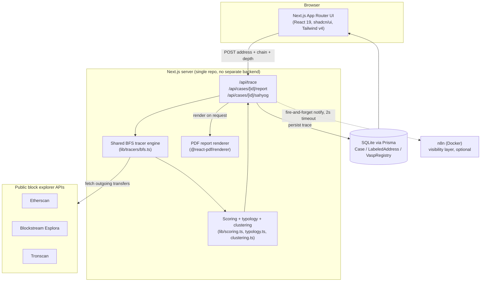
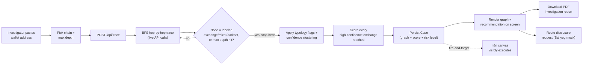
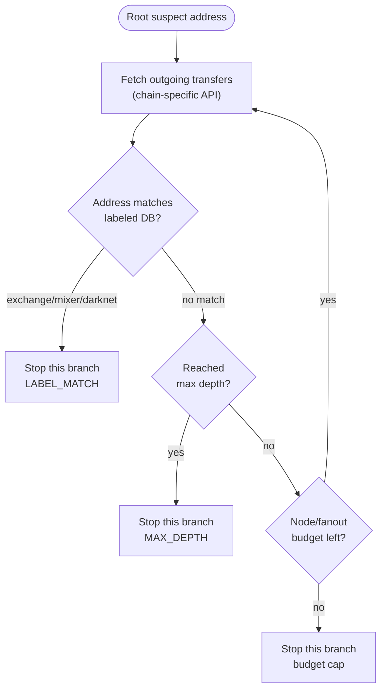
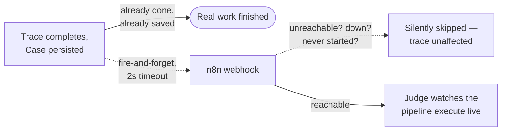

# VASPtrace — pitch deck source

This file is written to be handed to an AI slide-builder (or a human) to
turn into a deck. Each `##`/`###` section is roughly one slide's worth of
content, in presentation order. Mermaid code blocks are real flowcharts —
render them directly if your tool supports Mermaid, otherwise redraw them
as flowchart/diagram slides from the described nodes and edges.

Source of truth for anything below: [`ARCHITECTURE.md`](./ARCHITECTURE.md)
(technical reference) and [`PROGRESS.md`](./PROGRESS.md) (full build log,
dated). This doc is the narrative cut of both, for pitching rather than
building.

---

## 0. One-liner

**VASPtrace traces a suspect crypto wallet hop-by-hop across Ethereum,
Bitcoin, and Tron, and tells an Indian investigator not just *where the
money went*, but *which exchange to legally serve a disclosure request to
first* — ranked by whether that exchange will actually respond.**

Built solo in 5 days for Smart India Hackathon, problem statement 26182
(Ministry of Home Affairs / Indian Cybercrime Coordination Centre, I4C).

---

## 1. The problem

- Indian law enforcement increasingly hits crypto in investigations —
  ransomware payouts, UPI-fraud proceeds cashed out through exchanges,
  darknet-market payments.
- Tracing the money is only half the job. The actual bottleneck is
  *legal actionability*: which exchange do you send the disclosure request
  to, and will they even respond?
- Generic blockchain-intelligence tools (Chainalysis Reactor, Elliptic, TRM,
  Crystal, Arkham) answer "where did the money go." None of them are built
  around **Indian regulatory reality** — FIU-IND registration, an India
  nodal officer, and I4C's Sahyog disclosure-routing mechanism.
- A trace that ends at the *nearest* exchange isn't useful if that exchange
  is offshore, unregistered, and won't answer an Indian LEA's request. The
  investigator needs the nearest **actionable** one.

---

## 2. What we built — six things, one differentiator

1. **Live multi-chain tracer** — Ethereum, Bitcoin, Tron. Real public APIs,
   not synthetic data. Hop-by-hop, depth-limited, stops at a labeled
   exchange/mixer or a configurable max depth.
2. **Legal-actionability scoring (the differentiator)** — ranks every
   exchange the trace reaches by FIU-IND registration + India nodal officer
   + historical response reliability − hop distance. The nearest exchange
   is not always the top recommendation.
3. **Rule-based typology flags** — fan-out/smurfing, peel chains, rapid
   mixer hops — detected and drawn directly on the graph where the pattern
   happens, not buried in a case-level badge list. Explicitly labeled as
   heuristics, not AI/ML — no black-box claims.
4. **n8n-visualized pipeline** — the same trace pipeline, replayed on a
   live workflow canvas, so a judge watches the automation execute in real
   time instead of taking a finished screen on faith.
5. **Auto-generated investigation report + mock Sahyog routing** — a
   letterheaded PDF from the actual persisted trace (no re-computation,
   no placeholder data), and a one-click "route disclosure request"
   flow that shows exactly what payload would be sent to I4C's Sahyog
   platform (real integration isn't publicly available yet — clearly
   labeled simulated, never pretended otherwise).
6. **Authentication and role-based access** — because the sensitive thing
   here isn't the wallet address (that's public on-chain data anyone can
   read), it's *this system associating that address with an active I4C
   investigation*. Investigators see only their own cases; supervisors see
   all. Enforced server-side per case, not just hidden in the UI — one
   investigator cannot open another's case, PDF report, or disclosure
   routing even with a direct link.

**The one to lead with in the pitch: #2.** It's the thing a generic
blockchain-intelligence tool doesn't have, because it's specific to how
Indian crypto regulation and I4C actually work.

---

## 3. Architecture



**Tech stack:**

| Layer | Choice | Why |
|---|---|---|
| Frontend + backend | Next.js 16 (App Router), single repo | API routes and UI together — no separate service to deploy/sync for a 5-day build |
| Language | TypeScript throughout | one language, one type system, across tracer/scoring/UI |
| UI | React 19, shadcn/ui, Tailwind CSS v4 | fast to build a real design system on, not a bespoke one |
| Charts | recharts (via shadcn's chart components) | real bar/area charts on the case dashboard, not hand-rolled SVG |
| Graph visualization | react-force-graph-2d | force-directed, custom-painted nodes (glow, flag rings, on-canvas labels), curved animated links |
| Database | SQLite via Prisma ORM | zero-ops, trivially inspectable/seedable for a demo |
| Auth | hand-rolled sessions (Node stdlib `scrypt` + HMAC cookie) | one credentials flow doesn't need next-auth's provider/adapter framework, and v5 is still beta — see §10 |
| PDF generation | @react-pdf/renderer | stays in the JS/TS ecosystem, no Python microservice |
| Workflow visualization | n8n (self-hosted, Docker) | the one piece that's genuinely optional — see §9 |
| Theming | next-themes | real light/dark mode, system-aware |

---

## 4. What's live vs. simulated (full transparency)

Every non-trivial piece of logic is commented inline in the codebase as
either live or simulated. This table is not spin — it's the literal
project convention, enforced from day one.

| Piece | Status |
|---|---|
| Ethereum / Bitcoin / Tron tracers | **Live** — real public block-explorer APIs, zero synthetic data |
| Labeled address DB, VASP registry | **Live** — real, individually source-checked public data (16 VASPs, 18 labeled addresses: 15 exchange, 2 mixer, 1 ransomware) |
| Legal-actionability scoring | **Live** — real arithmetic over the seeded registry, score breakdown shown on screen, not a black box |
| Confidence clustering | **Live** — real graph-structural heuristics (forward-ratio, fan-in), not AI/ML |
| Typology flags | **Live** — real rule-based pattern detection over the traced graph |
| Auth + role-based access | **Live** — real password hashing (scrypt), real signed sessions, real per-case authorization enforced server-side. The demo *accounts* are seeded; the mechanism is not mocked |
| PDF report | **Live** — generated from the actual persisted trace |
| n8n pipeline visualization | **Real workflow**, illustrative re-check — the canvas genuinely executes on real trace data; the "check against labeled DB" node it shows is a visual mirror of a check Next.js already performed, not a second live lookup |
| Sahyog routing | **Simulated** — no public Sahyog API exists yet; the payload shown is exactly what would be sent, and it never leaves localhost |
| Cross-chain bridge correlation | **Out of scope**, roadmap only |

---

## 5. End-to-end flow



---

## 6. Deep dive — the tracer engine

One shared BFS engine (`lib/tracers/bfs.ts`); each chain is a thin adapter
that only knows how to fetch that chain's outgoing transfers.



- **Fixed caps, not adaptive backpressure**: a 5-outgoing-edge fan-out cap
  and a 60-node total budget keep a demo trace fast and bounded — a
  deliberate, documented tradeoff for a 5-day build, not an oversight.
- **Confidence tiers, not one binary match**: `high` = exact address match
  against the labeled DB; `medium` = forwards ≥80% of value to a known
  exchange (clustering heuristic); `low` = fan-in from ≥3 senders that
  forwards onward (pattern-based guess, no attribution). **Only `high`
  confidence can ever be the basis of an actual VASP recommendation** —
  medium/low surfaces for investigator attention but never drives a legal
  disclosure request on a guess.

---

## 7. Deep dive — legal-actionability scoring (the differentiator)

```
score = (FIU-IND registered ? 3 : 0)
      + (has India nodal officer ? 2 : 0)
      + response reliability (1-5)
      − hop distance
```

Only exact-match, `high`-confidence exchange nodes are scored at all — a
clustering guess can never outrank a real match, however high its score.

**Worked example**: a trace reaches two exchanges — one 1 hop away but
offshore and unregistered, one 3 hops away but FIU-IND registered with a
responsive India nodal officer. The nearer exchange scores lower. The
recommendation is the one an Indian LEA can actually get a response from,
with the full arithmetic shown on screen next to it — auditable, not a
"HIGH RISK" badge you have to trust blindly.

This is the answer to "why not just use Chainalysis" — Chainalysis tells
you where the money is. This tells you who to call.

---

## 8. Deep dive — typology flags

Three rule-based heuristics, explicitly labeled as heuristics (not AI/ML)
everywhere they appear in the UI:

| Flag | Trigger | Reads as |
|---|---|---|
| Fan-out / smurfing | ≥5 outgoing destinations from one node (tuned up from an original 3 after live validation showed 3 mostly just meant "an active wallet") | structuring to evade detection |
| Peel chain | 2 outgoing legs, one ≥4× the other | classic "peel off a small amount, move the rest" laundering pattern |
| Rapid mixer hop | mixer reached within 2 hops of the suspect | minimal laundering effort before obfuscation |

Flags render **on the graph itself** — a flagged node is larger and ringed
in the flag's color, a flagged edge is thicker and recolored — not just
listed as a badge underneath. An investigator sees exactly where in the
money trail the pattern happened.

---

## 9. Why n8n is a visibility layer, not the tracing engine

The natural objection: "isn't a workflow-automation tool a fragile
dependency for a law-enforcement product?" Answer: it isn't a dependency at
all, by construction.



- All real work (trace, scoring, persistence) happens in Next.js and is
  **already saved** before n8n is ever contacted.
- The notify call is fire-and-forget with a 2-second timeout, wrapped in
  try/catch, returns a soft warning instead of throwing.
- `N8N_TRACE_WEBHOOK_URL` / `N8N_SAHYOG_WEBHOOK_URL` are optional env vars
  — unset by default, meaning CI, a judge's laptop without Docker, or a
  quick sanity check all run the full product with zero n8n involvement.
- What n8n buys, when it's up: a judge watches the automation pipeline
  execute hop-by-hop on a live canvas in real time — more visceral than a
  finished screen, and closer to how this would actually plug into an LEA's
  existing automation stack.

---

## 10. Obstacles — and how we actually dealt with them

Real bugs, root-caused and fixed, not glossed over. Picked for the pitch
because each one demonstrates something about how the project was built,
not just that it works.

- **A dead IF node would have silently broken the entire n8n demo.**
  During the first *live* run of the n8n workflows (Docker had been down
  most of the week — see below), the "did this trace hit a VASP/mixer?"
  decision node turned out to be pinned to a legacy node version current
  n8n builds don't support. It didn't error — it silently routed every
  execution down the *false* branch, so the dashboard-push step could
  never have run, while every execution still showed a green "Success."
  The bug was invisible from the app side, because the notify call is
  fire-and-forget and only ever saw a `200`. Only running it for real, on
  camera, would have caught it before a judge did. Fixed by migrating the
  node and confirming both branches actually branch (a synthetic
  `true` payload and a synthetic `false` payload were each sent through
  and verified to take the correct path).
- **A rate-limit bug that only showed up under concurrency.** The tracer's
  API pacing paced requests *within* one trace, but said nothing about two
  traces running at once. Reproduced live — 6 concurrent traces produced
  real API rate-limit errors, and so did 6 simultaneous raw `curl` calls
  with the same key and no app involved, proving the real constraint was
  concurrent in-flight requests, not requests/second. Fixed by moving
  pacing to the shared resource itself (one in-flight request per chain's
  API, process-wide) instead of per-trace timing, which also let a chunk
  of now-redundant plumbing come out of the codebase entirely.
- **A production kernel/module mismatch took Docker down mid-week.** A
  silent kernel upgrade left the running kernel without a matching module
  tree on disk, so `dockerd` couldn't load `nf_tables` and iptables failed
  to initialize — no amount of `docker` debugging fixes a missing kernel
  module. Root-caused via `journalctl`, fixed by a reboot into a kernel
  whose modules actually existed. A reminder that infrastructure problems
  and application bugs need genuinely different diagnosis, and that
  "it's broken" is rarely the whole story.
- **A stale service worker from a different project made the UI look
  broken when it wasn't.** After a routine restart, the app rendered with
  no styling and stale markup — looked exactly like a build failure. It
  wasn't: the server was serving correct HTML the entire time, confirmed
  with a raw `curl`. A service worker left behind by an unrelated project
  previously dev-served on the same `localhost` port (service workers are
  scoped per browser *origin*, not per project) was intercepting every
  request and serving its own cached bundle instead. Fixed by unregistering
  it — but it's a standing risk on any shared dev machine, so it's now
  documented as the first thing to check if the UI ever looks a version
  behind the code.
- **A heuristic that looked right and wasn't.** The fan-out/smurfing flag
  was originally tuned to trigger at 3+ destinations. Live validation on a
  busy real wallet showed it firing on nearly every node — because the
  tracer's own internal fan-out storage cap was also 3, so the flag was
  mostly detecting "this wallet hit the tracer's own truncation ceiling,"
  not real smurfing behavior. Root-caused rather than just retuned the
  number: raised the threshold to only fire at the tracer's actual
  observable ceiling — the one case where "at least this many
  destinations" is a claim the data can really support.
- **A visual repaint silently broke accessibility that had already been
  fixed once.** Shifting the whole UI to a blue color scheme changed every
  background a risk-level badge sits against — re-verifying against the
  *literal pixel-composited* surface (not just assuming a lighter
  background was automatically safer) caught two colors that had quietly
  dropped below WCAG AA contrast. Same discipline applied again when dark
  mode went from "tokens exist but nothing can reach them" to actually
  reachable for the first time — measured, not assumed, before shipping.
- **We talked ourselves out of a bad security idea, then built the right
  one.** The initial instinct was to protect wallet addresses by hashing
  them, or writing them to a private chain. Both are security theater here:
  a wallet address isn't a secret — it's public, on-chain, and anyone
  checking whether a *specific* address is in the database already has the
  plaintext to hash and compare. The real exposure was different and
  simpler: the app had no login, so anyone who could reach the URL could
  see which addresses an I4C investigation was looking at. That's the
  sensitive fact, not the address. So we built auth and per-case
  authorization instead — and deliberately did *not* build the thing that
  would have looked more impressive in a diagram.
- **A deprecated file convention that fails silently.** The auth gate
  belongs in `middleware.ts` in every tutorial written before Next.js 16 —
  which renamed it to `proxy.ts`. The old filename doesn't error, doesn't
  warn, and doesn't run: an auth gate written that way would have looked
  correct in code review and protected nothing. Caught by reading the
  version's own docs before writing the file rather than after.

---

## 11. By the numbers

- **3 chains** traced live: Ethereum, Bitcoin, Tron
- **16 VASPs** in the legal-actionability registry, **18** individually
  source-verified labeled addresses (exchanges, mixers, a ransomware
  address)
- **82 real cases** traced during development and demo rehearsal — not a
  handful of cherry-picked screenshots
- **10/10** original plan items shipped with a working first pass by day 1,
  hardened through day 4 — plus auth and RBAC, added after the fact when a
  security review of our own design said it was needed (see §10)
- **Zero** synthetic/mocked blockchain data anywhere in the live paths —
  every trace is a real API call

---

## 12. Roadmap — what's next

Deliberately out of scope for a 5-day build, kept as credible next steps
rather than vague hand-waving:

- **Real Sahyog/I4C API integration**, once one is publicly available —
  the mock payload is already shaped to match what that integration would
  need.
- **Cross-chain bridge correlation** — following a suspect's funds across a
  bridge from one chain to another, not just within a single chain.
- **ML-assisted typology detection** as a second opinion alongside the
  current rule-based heuristics, kept explicitly separate and labeled so
  the transparency story doesn't regress.
- **Multi-investigator case collaboration** — shared case notes, and an
  audit log of who viewed or routed what. Auth and role-based access are
  already built (§2, §4); the audit trail on top of them is the next step.
- **Encryption at rest** for the case database, plus SSO instead of local
  credentials — both needed before any real multi-tenant LEA deployment.
- **Live OFAC/sanctions-list sync** for the labeled-address DB instead of a
  point-in-time seed.

---

## 13. Closing

VASPtrace isn't trying to out-build Chainalysis in five days. It's solving
the specific, narrower problem those tools don't: once you know where the
money went, **who in India can actually make the exchange answer** — and
showing that answer's arithmetic on screen instead of asking anyone to
trust a badge.
