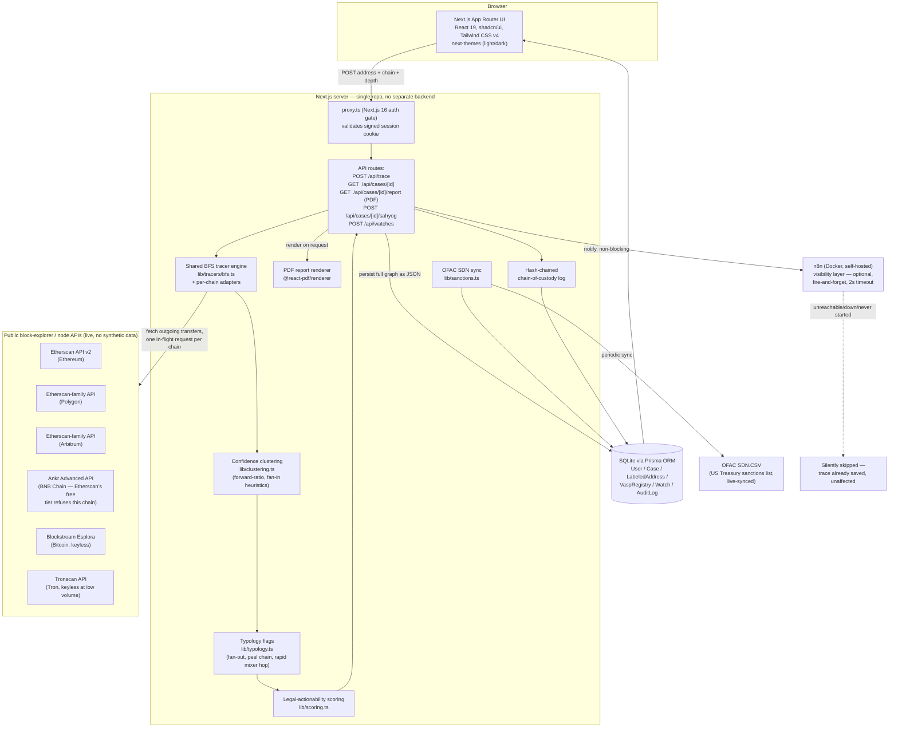
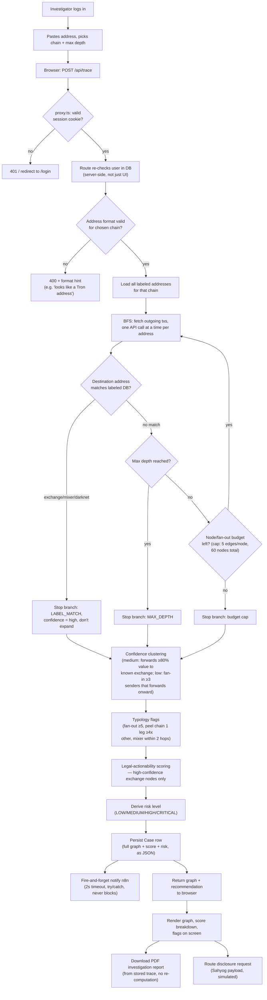
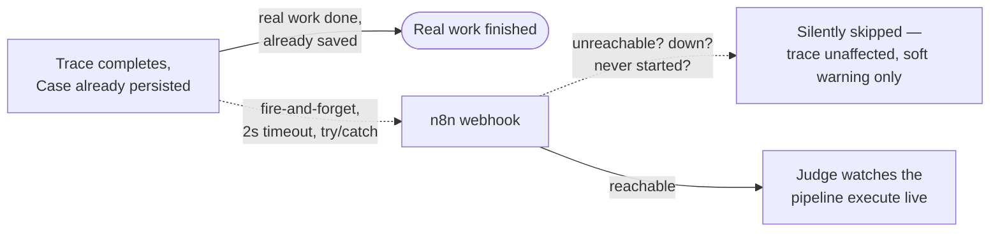

# VASPtrace — SIH pitch-deck content prompt

Source material pulled from `PITCH.md`, `PLAN.md`, `ARCHITECTURE.md`, and
`EXPLAINER.md`. This file is the raw content for a 6-slide SIH deck — no
slides built, just everything each slide needs, organized slide-by-slide.

---

## Slide 1 — Problem Statement & Team Information

**Problem statement:** SIH 2026, PS **26182**, Ministry of Home Affairs (MHA)
/ Indian Cybercrime Coordination Centre (**I4C**) — a blockchain intelligence
platform for Indian law enforcement to trace a suspect crypto wallet to the
**nearest legally-actionable VASP/exchange**.

**Project name:** VASPtrace

**One-liner (use as the slide's hook, not filler):**
> Traces a suspect crypto wallet hop-by-hop across Ethereum, Polygon,
> Arbitrum, Bitcoin, and Tron, and tells an Indian investigator not just
> *where the money went*, but *which exchange to legally serve a disclosure
> request to first* — ranked by whether that exchange will actually respond.

**Team:** built solo, 5-day build window (2026-09-07 to 2026-09-14 for
submission; hardened through 2026-09-16).

**Slide space discipline:** lead with the one-liner + PS number + team name.
Do not spend slide-1 space on tech stack or architecture — those have
dedicated slides. The only other thing worth a line here is the "by the
numbers" hook (below) since it's the single most credibility-building line
in the whole deck and judges see it first.

**One credibility stat to consider putting on slide 1 itself:**
- 6 chains traced live, 16 VASPs scored, 456 live-synced OFAC-sanctioned
  addresses, 100+ real cases traced during dev/rehearsal (quote whatever
  `/cases` shows on demo day — the count drifts with every rehearsal), zero
  synthetic blockchain data anywhere in the live paths.

---

## Slide 2 — Problem Understanding & Proposed Solution

### The problem, precisely

What an investigator actually faces today, step by step:

1. A complaint arrives with a wallet address (victim's transaction receipt,
   or a scam platform's "deposit" address).
2. They open a block explorer — raw data, dozens/hundreds of payments to
   unnamed addresses.
3. They follow one outgoing payment by hand, then the next. Each hop
   multiplies candidates. Launderers add hops, split amounts (fan-out /
   smurfing), peel off slices (peel chains), route through mixers —
   specifically to make manual tracing impractical.
4. Even reaching something that *looks* like an exchange, they need
   certainty (a tag, a sanctions entry).
5. **The step every commercial tool stops short of:** which exchange do you
   actually send a legal disclosure request to? If the trail touches three
   exchanges — one offshore/unregistered, one Indian FIU-IND-registered with
   a local nodal officer — the right target isn't necessarily the nearest
   hop. A request to an unresponsive offshore exchange burns weeks.
6. Finally, write it up in a form a court and a compliance team accept, with
   every transaction cited.

### Why this specific problem is worth solving

Tracing is a solved-enough problem for big commercial vendors (Chainalysis,
Elliptic, TRM, Crystal, Arkham). **Legal actionability in the Indian
regulatory context is not.** None of them are organized around FIU-IND
registration, an India nodal officer, or I4C's Sahyog disclosure-routing
mechanism. The MHA/I4C brief is specifically about getting from a suspect
address to the *nearest legally-actionable* VASP — that qualifier is where
VASPtrace concentrates every design decision.

### Proposed solution — six pieces, one differentiator

| # | Piece | What it does |
|---|---|---|
| 1 | Live multi-chain tracer | Ethereum, Polygon, Arbitrum, Bitcoin, Tron + USDT/USDC stablecoin flows. Real public block-explorer APIs, zero synthetic data. Hop-by-hop BFS, stops at a labeled exchange/mixer or max depth. |
| 2 | **Legal-actionability scoring (the differentiator)** | Ranks every exchange reached by FIU-IND registration + India nodal officer + historical response reliability − hop distance. Nearest exchange is not always top recommendation. |
| 3 | Rule-based typology flags | Fan-out/smurfing, peel chains, rapid mixer hops — drawn directly on the graph at the node/edge where it happens. Explicitly labeled heuristics, not AI/ML — no black-box claims. |
| 4 | n8n-visualized pipeline | The same trace pipeline replayed on a live workflow canvas — a judge watches automation execute, not a static screenshot. |
| 5 | Auto-generated investigation report + mock Sahyog routing | Letterheaded PDF from the actual persisted trace; one-click "route disclosure request" shows the exact payload that would go to I4C's Sahyog platform (clearly labeled simulated — no public Sahyog API exists yet). |
| 6 | Authentication + role-based access | The sensitive fact isn't the wallet address (public, on-chain) — it's *this system associating that address with an active I4C investigation*. Investigators see only their own cases; supervisors see all; enforced server-side, not just hidden in UI. |

**Lead the pitch with #2.** It's the thing no generic blockchain-intelligence
tool has, because it's specific to how Indian crypto regulation and I4C
actually operate.

### What makes it different (comparison table for this slide)

| Step | Manual investigation today | With VASPtrace |
|---|---|---|
| Follow the money | By hand, hop by hop | Automatic BFS, up to 10 hops |
| Recognize known entities | Search tags one address at a time | Every address checked against a verified label DB |
| Spot laundering patterns | Experience and eyeballing | Rule-based typology flags drawn on the graph |
| Pick the legal target | Guesswork or "nearest exchange" | Ranked legal-actionability score with visible arithmetic |
| Write it up | Hours of manual report writing | One-click PDF from the stored trace |
| Send the request | Drafting from scratch | Pre-built disclosure payload (simulated routing, real payload shape) |
| Keep it confidential | — | Login + per-investigator case scoping |

### Comparison with existing approaches (for the "what makes it different" ask)

- **Chainalysis (Reactor/KYT), Elliptic, TRM Labs, Crystal Intelligence,
  Arkham** — all answer "where did the money go, and who is it," backed by
  far larger attribution databases, full token coverage, and real
  cross-chain/bridge correlation. None of them, to public knowledge, rank
  exchanges by *Indian legal actionability* — FIU-IND status, India nodal
  officer, response reliability — or route through I4C's Sahyog mechanism.
  Their scores also aren't generally presented as auditable line-by-line
  arithmetic.
- **Free block explorers (Etherscan, Blockchair, Tronscan)** — manual,
  one-address-at-a-time, no case management, scoring, or reporting.
- **The honest positioning line:** Chainalysis-class tools tell you *where*
  the money is; VASPtrace tells an Indian investigator *who to ask first,
  and why*. It doesn't try to out-build them — it targets the decision layer
  they leave to the investigator, and could in principle sit on top of a
  commercial attribution dataset rather than compete with one.

---

## Slide 3 — Technical Approach

### System architecture (flowchart — render as-is, Mermaid-compatible)



### Process flow — one trace, end to end



### Legal-actionability scoring — the differentiator, exact formula

```
score = (FIU-IND registered ? 3 : 0)
      + (has India nodal officer ? 2 : 0)
      + response reliability (1–5)
      − hop distance
```

- Only `high`-confidence exact-match exchange nodes are scored. On Bitcoin,
  a common-input-ownership match to a known exchange address also scores,
  but routes only as an **ownership-confirmation request** naming the
  inference and the transaction behind it.
- Behavioral guesses (value-forwarding, fan-in patterns — the `medium`/`low`
  confidence tiers) are never scored and never drive an actual disclosure
  request.
- **Worked example:** trace reaches two exchanges — one 1 hop away but
  offshore/unregistered, one 3 hops away but FIU-IND registered with a
  responsive India nodal officer. The nearer exchange scores *lower*; the
  farther one is recommended, with the arithmetic shown on screen.

### Technology stack

| Layer | Choice | Why |
|---|---|---|
| Frontend + backend | Next.js 16 (App Router), single repo | API routes and UI together — no separate service to deploy/sync for a 5-day build |
| Language | TypeScript throughout | one language, one type system, across tracer/scoring/UI |
| UI | React 19, shadcn/ui, Tailwind CSS v4 | real design system, not bespoke |
| Charts | Recharts (via shadcn chart components) | real bar/area charts on the case dashboard |
| Graph visualization | react-force-graph-2d | force-directed, custom-painted nodes (glow, flag rings, on-canvas labels), curved animated links |
| Database | SQLite via Prisma ORM (libSQL adapter) | zero-ops, trivially inspectable/seedable for a demo, works offline for stored cases |
| Auth | Hand-rolled sessions — Node stdlib `crypto` (scrypt password hashing, HMAC-signed cookie, constant-time compare) | one credentials flow doesn't need next-auth's provider/adapter framework; next-auth v5 was still beta |
| PDF generation | @react-pdf/renderer | stays in JS/TS ecosystem, no Python microservice |
| Workflow visualization | n8n (self-hosted, Docker Compose) | the one genuinely optional piece — see below |
| Theming | next-themes | real light/dark mode, system-aware |
| Chain APIs | Etherscan API v2 (ETH/Polygon/Arbitrum), Ankr Advanced API (BNB Chain — Etherscan's free tier refuses it), Blockstream Esplora (Bitcoin, keyless), Tronscan (Tron, keyless at low volume) | best free, live, keyless-where-possible data per chain |
| Sanctions data | OFAC SDN.CSV (US Treasury), live-synced | real public feed, no synthetic sanctions data |
| Dev tooling | tsx (runs seed/self-check scripts), ESLint | catches bugs like React hook misuse before demo |

**Deliberately not used, and why:** next-auth (oversized, was in beta), a
separate backend service (unneeded for this scope), AI/ML for the scoring
or typology engine (breaks explainability — a judge or defense lawyer must
be able to audit *why* the tool said what it said), a toast/notification
library (Sahyog result renders inline).

### Why n8n is a visibility layer, not the tracing engine



- All real work (trace, scoring, persistence) happens in Next.js and is
  **already saved** before n8n is ever contacted.
- `N8N_TRACE_WEBHOOK_URL` / `N8N_SAHYOG_WEBHOOK_URL` are optional env vars,
  unset by default — CI, a judge's laptop without Docker, or a quick sanity
  check all run the full product with zero n8n involvement.
- What it buys when up: a judge watches the automation pipeline execute
  hop-by-hop on a live canvas in real time, closer to how this would plug
  into an LEA's existing automation stack.

---

## Slide 4 — Feasibility & Viability

### It's already built and running, not a concept

- 10/10 original plan items shipped with a working first pass by day 1 of a
  5-day build, hardened through day 4 — plus auth/RBAC added afterward.
- 98 real cases traced during development and demo rehearsal (not a handful
  of cherry-picked screenshots).
- Zero synthetic/mocked blockchain data anywhere in the live paths — every
  trace is a real API call against a real chain.

### Resource requirements — deliberately minimal

- **No paid data subscription.** Every chain API used is free (Etherscan
  free tier with API key, Ankr's free tier for BNB Chain; Blockstream
  Esplora and Tronscan are free and keyless at demo volume).
- **No separate backend service.** Next.js API routes + UI in one repo —
  one thing to deploy, no service-to-service auth or sync to build for a
  5-day timeline.
- **Zero-ops database.** SQLite via Prisma — trivially inspectable, seedable,
  and runs entirely offline for stored cases (no live API dependency to
  demo a previously-traced case).
- **n8n is optional infrastructure**, not a hard dependency — the product
  runs fully without it (see slide 3).

### Implementation risks and how they were actually mitigated (not hypothetical — these happened during the build)

| Risk | What happened | Mitigation |
|---|---|---|
| Silent workflow failure | A dead n8n decision node was pinned to a legacy version; it silently routed every execution down the *false* branch while still showing green "Success" | Only caught by running the workflow live, on camera, before a judge would; fixed by migrating the node and verifying both branches actually branch with synthetic true/false payloads |
| Rate limiting under concurrency | Tracer paced requests *within* one trace but not *across* concurrent traces; 6 concurrent traces produced real API rate-limit errors | Reproduced deliberately (including via raw `curl`, no app involved) to confirm the real constraint was concurrent in-flight requests, not requests/second; fixed by moving pacing to the shared per-chain resource, process-wide |
| Infrastructure failure (Docker down) | A silent kernel upgrade left the running kernel without a matching module tree, so `dockerd` couldn't load `nf_tables` | Root-caused via `journalctl`, not `docker` debugging; fixed with a reboot into a kernel with matching modules |
| Heuristic false positives | Fan-out/smurfing flag fired on nearly every node because the tuning threshold (3) matched the tracer's own internal truncation cap (also 3) | Root-caused rather than blindly retuned: raised the threshold to the tracer's actual observable ceiling |
| Accessibility regression | A UI recolor silently dropped two risk-badge colors below WCAG AA contrast | Re-verified against the literal pixel-composited surface, not assumed from a lighter background |
| Wrong security instinct | Initial idea was to hash wallet addresses or use a private chain — security theater, since addresses are public on-chain data anyone can already hash and compare | Root-caused the actual sensitive fact (which address is under *investigation*, not the address itself) and built auth + per-case server-side authorization instead |
| Framework breaking change | Next.js 16 renamed `middleware.ts` to `proxy.ts`; the old filename doesn't error or warn, it just silently doesn't run — an auth gate written the old way would look correct in review and protect nothing | Caught by reading the version's own docs before writing the file |

### Scalability path

- **Chains:** adding a chain is a thin adapter (fetch that chain's outgoing
  transfers) behind the one shared BFS engine — proven by adding
  Polygon/Arbitrum post-submission without touching the core tracer.
- **Data depth:** current fixed caps (5-edge fan-out, 60-node budget) are a
  documented demo-speed tradeoff, not an architectural ceiling — raising them
  is a config change, not a rewrite.
- **Multi-tenant deployment path already scoped:** encryption at rest for
  the case DB and SSO (replacing local credentials) are the two items needed
  before real multi-LEA deployment — both clearly identified, not hand-waved.
- **Real Sahyog/I4C integration:** the mock payload is already shaped to
  match what a real integration would need, so swapping simulated for live
  routing is a wiring change, not a redesign.

### Economic viability

- Runs on free-tier public APIs and a single SQLite file — no infrastructure
  spend to pilot with a real I4C unit.
- No AI/ML licensing or GPU cost — the scoring and typology engines are
  rule-based arithmetic, which is also *why* they're auditable in court.
- The most expensive future item (encryption at rest, SSO, real Sahyog
  integration) is standard enterprise-deployment cost, not a research risk.

---

## Slide 5 — Impact & Benefits

### Who benefits

- **State and central cybercrime investigators** (the direct MHA/I4C user) —
  turns a multi-hour manual block-explorer trace into a bounded automatic
  BFS trace with a ranked, auditable legal target at the end.
- **I4C / Sahyog operations** — a disclosure request that's pre-shaped to the
  real routing mechanism, with evidence (typed edges, confidence tier, score
  breakdown) attached instead of assembled from scratch per case.
- **Courts and defense counsel** — every recommendation is arithmetic shown
  on screen, not a "HIGH RISK" badge asked to be trusted blindly; a
  disclosure request is worded to match exactly what was observed (a
  contract call is never described as a payment).
- **Victims of crypto-enabled fraud** (ransomware payouts, UPI-fraud proceeds
  cashed out through exchanges, darknet-market payments) — faster, more
  targeted legal action against the exchange actually likely to respond.

### The real-world impact case

- The bottleneck in Indian crypto investigations is not *finding* the money
  trail — it's **legal actionability**: knowing which exchange to serve, and
  whether they'll respond at all. VASPtrace directly targets that bottleneck
  rather than re-solving tracing, which mature commercial tools already do
  well.
- A wrong or slow choice of disclosure target (nearest exchange instead of
  the actionable one) can burn weeks per case — multiplied across the volume
  of crypto-touching cybercrime complaints I4C already handles, that delay
  compounds into real backlog.
- Because the scoring is transparent arithmetic and the confidence tiers are
  explicit, the tool produces evidence that survives scrutiny in court —
  not just an investigative lead that stops working once someone asks "how
  do you know?"

### How it scales as impact

- Same architecture extends to any additional chain, any additional VASP
  registry entry, or any additional Indian regulatory signal (e.g. future
  RBI/FIU-IND rule changes) without redesigning the scoring model — it's
  additive weights and registry rows, not new logic.
- The audit trail (hash-chained chain-of-custody log) and RBAC groundwork
  mean this can grow toward multi-investigator, multi-unit deployment
  without re-architecting security from scratch.
- Positioned as a decision layer that could sit **on top of** a commercial
  attribution dataset (Chainalysis/Elliptic-class) rather than compete with
  one — meaning the impact isn't capped by VASPtrace's own smaller label
  database if a future integration pairs it with a larger one.

---

## Slide 6 — Research & References

### Primary regulatory/legal grounding

- **Ministry of Home Affairs (MHA) / Indian Cybercrime Coordination Centre
  (I4C)** — SIH problem statement 26182, and the Sahyog disclosure-routing
  mechanism this tool's mock routing is shaped around.
- **FIU-IND (Financial Intelligence Unit – India)** — VASP registration
  status is the primary "is this exchange legally reachable by an Indian LEA"
  signal in the scoring formula.
- **OFAC SDN List (US Treasury Office of Foreign Assets Control)** — real,
  live-synced sanctions data (`SDN.CSV` public export), 456 sanctioned
  addresses synced as of 2026-09-14. Used for sanctions-flag labeling, not
  fabricated or hand-picked.

### Data sources (all real, individually source-verified, not synthetic)

- **16 VASPs** in the legal-actionability registry (WazirX, CoinDCX, ZebPay,
  CoinSwitch, Binance, and others), each marked for FIU-IND registration
  status from public information.
- **46 labeled addresses** (38 exchange, 5 DeFi bridge / cross-chain swap
  service, 2 mixer, 1 ransomware) across Ethereum, Polygon, Arbitrum, BNB
  Chain, Bitcoin, and Tron — hand-verified against public block-explorer
  tags, not scraped in bulk. Bridge contracts are identified and flagged
  like a mixer; following funds across to the destination chain is a
  separate, deferred capability (see Slide 3's roadmap note).
- **2 stablecoin issuer entries** (Tether/Circle) for the issuer-freeze
  actionability path — issuers can freeze funds independent of which
  exchange they reached.

### Block-explorer / chain data APIs (live integrations, not references)

- Etherscan API v2 (Ethereum, and the same Etherscan-family API for Polygon
  and Arbitrum)
- Ankr Advanced API (BNB Chain — the one chain Etherscan's free tier
  refuses; live-verified against BscScan's own recorded balance)
- Blockstream Esplora API (Bitcoin, free and keyless)
- Tronscan API (Tron, free and keyless at demo volume)

### Existing solutions surveyed (for the competitive-landscape comparison — see Slide 2)

- Chainalysis (Reactor, KYT)
- Elliptic (Investigator, Navigator, Lens)
- TRM Labs (Forensics, Transaction Monitoring)
- Crystal Intelligence (formerly Crystal Blockchain)
- Arkham Intelligence
- Free public block explorers (Etherscan, Blockchair, Tronscan) as the
  manual-baseline comparison point

*(Descriptions of these five commercial products are drawn from general
public knowledge of the products, not verified inside this repository —
say so if asked, rather than overstating VASPtrace's competitive research.)*

### Internal project documentation (for anyone building the slide who wants to go deeper)

- `docs/PLAN.md` — original 5-day brief, source of truth for scope
- `docs/ARCHITECTURE.md` — full technical reference
- `docs/PROGRESS.md` — dated build log against every plan item
- `docs/ROADMAP.md` — engineering detail behind the "what's next" items
- `docs/EXPLAINER.md` — long-form walkthrough, including Part 8/9 (competitor
  landscape and differentiation) and Part 10 (honest limitations)
- `docs/PITCH.md` — narrative cut of the above two, written for a slide-builder
